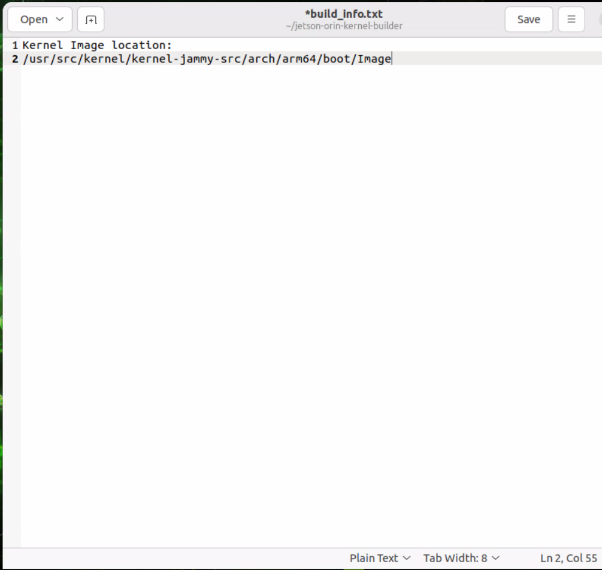
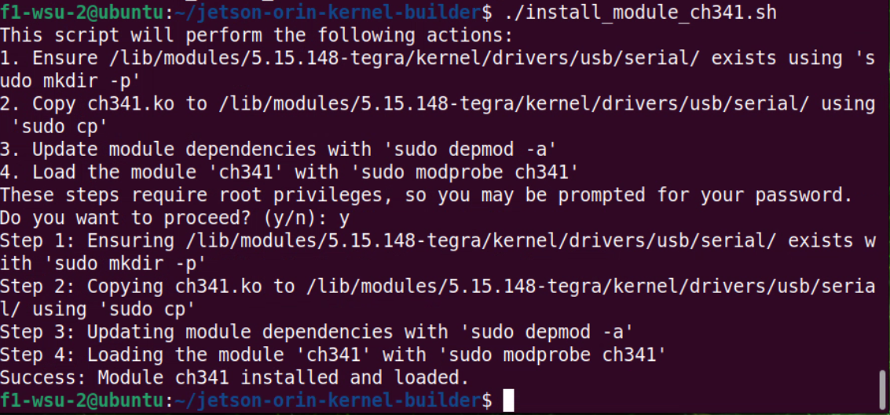
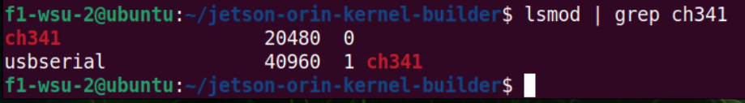
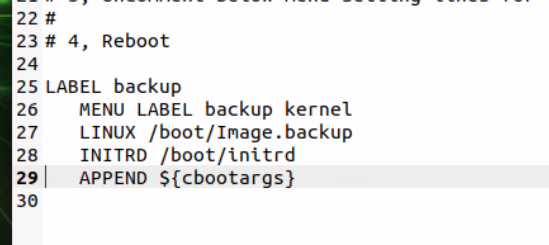
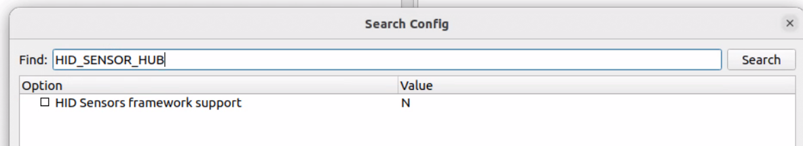
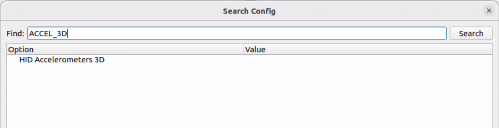

.. _doc_info_realsense_d435i:

INFO - Realsense D435i
==================================

Install dependencies
--------------------

1. Make Ubuntu up-to-date including the latest stable kernel

   .. code-block:: bash

       sudo apt-get update && sudo apt-get upgrade && sudo apt-get dist-upgrade

2. Install the core packages required to build librealsense binaries and the affected kernel modules

   .. code-block:: bash

       sudo apt-get install libssl-dev libusb-1.0-0-dev libudev-dev pkg-config libgtk-3-dev

   .. note::

      Certain librealsense CMake flags (e.g. CUDA) require CMake 3.8+ which may not be available via the default apt repositories on some Ubuntu LTS releases.

3. Install build tools

   .. code-block:: bash

       sudo apt-get install git wget cmake build-essential

4. Prepare Linux backend and development environment

   Unplug any connected RealSense camera and run

   .. code-block:: bash

       sudo apt-get install libglfw3-dev libgl1-mesa-dev libglu1-mesa-dev

Jetson-specific instructions
--------------------------

1. Jetson Orin Kernel Builder
============================

`jetson-orin-kernel-builder <https://github.com/jetsonhacks/jetson-orin-kernel-builder>`_

Tools to build the Linux kernel and modules on board the Jetson AGX Orin, Orin Nano, or Orin NX. This tool is designed for beginning to intermediate users. Be sure to read the entire document in the repository before proceeding.

.. code-block:: bash

   git clone https://github.com/jetsonhacks/jetson-orin-kernel-builder.git
   cd jetson-orin-kernel-builder

Getting Kernel and Module Sources
---------------------------------

Run the following from the repository root to fetch the kernel and module sources:

.. code-block:: bash

   ./scripts/get_kernel_sources.sh

Editing the Kernel Configuration
--------------------------------

Edit the kernel-builder configuration using the provided GUI script:

.. code-block:: bash

   ./scripts/edit_config_gui.sh

You can use the GUI to set device and kernel options:

.. image:: media/kernel_config_gui.png
   :alt: Kernel configuration GUI
   :align: center
   :width: 600px

Searching for the CH341 Driver

Use **Ctrl+F** to search for **CH341**.

.. image:: media/search_ch341.png
   :alt: Search for CH341
   :align: center
   :width: 480px

Next, click the letter **N** to change it to **M** for the *CH341 Single Port Driver* so it is built as a module.

.. image:: media/ch341_to_module.png
   :alt: Set CH341 to Module (M)
   :align: center
   :width: 480px

When finished, save and quit the configuration editor to apply the change.

Building the Kernel Image
-------------------------

Run the kernel build and module installation scripts from the repository.  
This step may take up to **30 minutes**.

.. code-block:: bash

   ./scripts/make_kernel.sh

Copy the path to the generated kernel image. You will need it later

.. image:: media/path_to_image.png
   :alt: Kernel build output path
   :align: center
   :width: 600px

Next, you will edit the build_info.txt file 

.. code-block:: bash
    
    gedit build_info.txt

Edit the document to include the path to the kernel image you copied earlier.

Building the Kernel Modules
-------------------------

Build the kernel modules using the provided script.

.. code-block:: bash

   ./scripts/make_kernel_modules.sh

When prompted Do you want to install the modules? Type **N** and press Enter.

Installing a New Modules
-------------------------

Run this script to get Module information.

.. code-block:: bash

   ./scripts/module_info.sh -s CH34

Look for the module name **ch341** and see if it is in the right location:

.. image:: media/CH341_module_name.png
   :alt: Kernel build output path
   :align: center
   :width: 600px

Using the module location make sure it is in there:

..code-block:: bash

    ls /usr/src/kernel/kernel-jammy-src/drivers/usb/serial/ch341.ko

Output should be something like this:

.. image:: media/ch341_module_ko_found.png
   :alt: Kernel build output path
   :align: center
   :width: 600px

More detailed information about the module by running:

.. code-block:: bash

   ./scripts/module_info.sh CONFIG_USB_SERIAL_CH341

.. image:: media/ch341_module_deep.png
   :alt: Kernel build output path
   :align: center
   :width: 600px

Copy the ch341 module to the current directory: (Make sure to use the correct path you found when you located the module earlier)

.. code-block:: bash

    cp /usr/src/kernel/kernel-jammy-src/drivers/usb/serial/ch341.ko .

Create an install module script:

.. code-block:: bash

    ./scripts/install_module_author.sh ch341 drivers/usb/serial

Use the script to install the module (type 'y' when prompted):

.. code-block:: bash

    ./install_module_ch341.sh

Output should be something like this:

verify the module is installed:

.. code-block:: bash

    lsmod | grep ch341

Output should be something like this:

Installing the Kernel Image
-------------------------

Run the following script to install the kernel image:

Make a backup of your current kernel image:

.. code-block:: bash

    cd /boot/extlinux/
    sudo cp extlinux.conf extlinux.conf.original

Edit the file:

.. code-block:: bash

    sudo gedit extlinux.conf

Make a backup copy of the Image (use a new terminal window):

.. code-block:: bash

    cd /boot
    sudo cp Image Image.backup

Go back to the extlinux.conf file and unccomment the Label Backup lines:

Pre-Edit

.. image:: media/config_pre_edit.png
   :alt: Kernel build output path
   :align: center
   :width: 600px

Post-Edit

Copy line 10 and replace line 29 like the image below :

.. image:: media/config_append_change.png
   :alt: Kernel build output path
   :align: center
   :width: 600px

When complete Save and close the file

Go back to jetson-orin-kernel-builder directory:

.. code-block:: bash

    cd jetson-orin-kernel-builder

Copy the kernel image:

.. code-block:: bash

    sudo cp /usr/src/kernel/kernel-jammy-src/arch/arm64/boot/Image /boot/Image

Reboot your Jetson:

JetPack 6 Orin Kernel Builder Video Walkthrough
---------------------------

This process applies to **JetPack 6**. A supporting walkthrough video is available on YouTube.

.. raw:: html

   

       <iframe width="560" height="315"
               src="https://www.youtube.com/embed/7P6I2jeJNYo"
               title="Jetson Orin Kernel Builder — YouTube"
               frameborder="0"
               allow="accelerometer; autoplay; clipboard-write; encrypted-media; gyroscope; picture-in-picture"
               referrerpolicy="strict-origin-when-cross-origin"
               allowfullscreen>
       </iframe>
   

2. Jetson Orin helper: JetsonHacks `jetson-orin-librealsense <https://github.com/jetsonhacks/jetson-orin-librealsense>`_

   Clone the JetsonHacks helper repository and follow its README for Jetson-specific build and install instructions:

   .. code-block:: bash

       git clone https://github.com/jetsonhacks/jetson-orin-librealsense.git
       cd jetson-orin-librealsense/build

Run this patch

.. code-block:: bash

   ./patch-for-realsense.sh

Build the Modules:
-----------------

Switch over to the kernel building directory:

.. code-block:: bash

   cd ~/jetson-orin-kernel-builder/

Run the config gui:

.. code-block:: bash
    
    ./scripts/edit_config_gui.sh

Use **Ctrl+F** to search for **HID_SENSOR_HUB**.

Set the value of the HID_SENSOR_HUB to **M** by clicking on the letter **N** and changing it to **M**.

.. image:: media/hid_sensor_hub_to_m.png
   :alt: Kernel build output path
   :align: center
   :width: 600px

Search for **ACCEL_3D**.

Set the value of the ACCEL_3D to **M** by clicking on the letter **N** and changing it to **M**.

.. image:: media/accel_3d_to_m.png
   :alt: Kernel build output path
   :align: center
   :width: 600px

.. Install librealsense2
.. --------------------

.. Clone/Download the latest stable version of librealsense2 in one of the following ways:

.. - Clone the librealsense repo

..   .. code-block:: bash

..       git clone https://github.com/realsenseai/librealsense.git

.. - Download and unzip the latest stable librealsense2 version from the master branch:

..   `RealSense.zip <https://github.com/realsenseai/librealsense/archive/master.zip>`_

.. Install the video for Linux (v4l2) driver

.. .. code-block:: bash

..     sudo apt install v4l-utils

.. Run the RealSense permissions script from the librealsense root directory:

.. .. code-block:: bash

..     cd librealsense
..     ./scripts/setup_udev_rules.sh

.. .. note::

..     You can remove the permissions by running:

..     ./scripts/setup_udev_rules.sh --uninstall

.. Build librealsense using the RSUSB backend (Jetson-friendly)

.. On Jetson systems, the RealSense kernel patch script targets Ubuntu generic kernels and will fail on the NVIDIA tegra kernel. Instead of modifying the kernel, librealsense can be built using its RSUSB backend, which communicates with the camera directly over USB from user space.

.. From the librealsense root directory:

.. .. code-block:: bash

..     cd ~/librealsense
..     mkdir -p build
..     cd build

..     cmake .. \
..      -DFORCE_RSUSB_BACKEND=true \
..      -DBUILD_EXAMPLES=true

..     make -j$(nproc)
..     sudo make install
..     sudo ldconfig

.. Check the patched modules installation by examining the generated log and inspecting the latest entries in the kernel log:

.. .. code-block:: bash

..     sudo dmesg | tail -n 50

.. The log should indicate that a new _uvcvideo_ driver has been registered. Refer to `Troubleshooting <#troubleshooting-installation-and-patch-related-issues>`_ in case of errors/warning reports.

Other Resources
-------------------- 

Installing Intel RealSense SDK 2.0: `Jetson Hacks install Intel RealSense <https://jetsonhacks.com/2025/03/20/jetson-orin-realsense-in-5-minutes/>`_

Product page: `Intel RealSense D435i <https://www.realsenseai.com/products/depth-camera-d435i/>`_

Getting started: `RealSense developer docs <https://dev.realsenseai.com/docs/docs-get-started>`_

.. raw:: html

    

        <iframe width="560" height="315" src="https://www.youtube.com/embed/FpMCJsg_KmE?si=qhhzguxsaBv_YG6D" title="YouTube video player" frameborder="0" allow="accelerometer; autoplay; clipboard-write; encrypted-media; gyroscope; picture-in-picture; web-share" referrerpolicy="strict-origin-when-cross-origin" allowfullscreen></iframe>
    
 