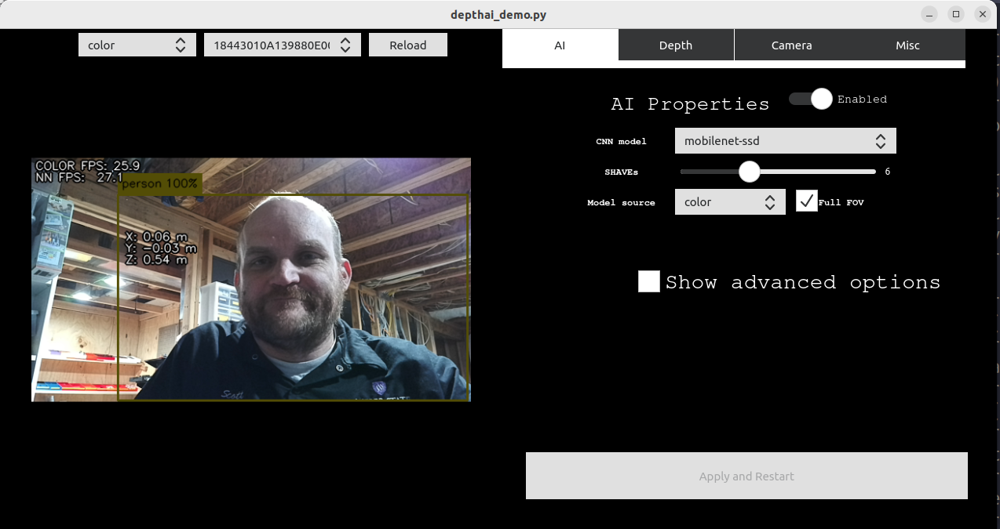

==============
INFO - Stereo Cameras
==============

Introduction
============

Stereo cameras are an integral part of perception systems in autonomous
vehicles. Unlike single-lens cameras, stereo cameras capture two or more
2D images of a scene from different angles. The images are then combined
to form a 3D representation, providing depth perception, which is crucial
for applications such as obstacle detection, lane tracking, and mapping.

Why 3 Lenses?
=============

You may encounter stereo cameras with three lenses. These are called
*trinocular* setups and offer several advantages:

1. **Depth Accuracy**
   An additional lens allows the system to compare more than one pair of
   images for depth estimation, improving accuracy.

2. **Field of View**
   Each lens can be optimized for a different field of view (FoV),
   providing a more complete representation of the environment.

3. **Redundancy**
   If one lens is obstructed or fails, the third lens can provide backup.

Trifocal Lenses
---------------

A trifocal setup typically includes three lenses aligned horizontally.
Trifocal lenses enable:

1. **More Matched Points**
   The trifocal tensor allows simultaneous matching of points across
   three views, providing richer depth information.

2. **Improved Confidence**
   Additional viewpoints help disambiguate complex scenes, increasing
   confidence in depth estimates.

3. **Enhanced Redundancy**
   Redundancy is further improved if one lens becomes unavailable.

Strengths and Weaknesses
========================

Strengths
---------

1. **Cost-Effective**
   Generally less expensive than LiDAR systems.

2. **High Resolution**
   Capable of capturing high-detail 2D images.

3. **Versatility**
   Can operate in a wide range of lighting conditions.

Weaknesses
----------

1. **Computational Overhead**
   Depth estimation requires significant processing power.

2. **Limited Range**
   Typically shorter effective range compared to LiDAR.

3. **Sensitivity to Lighting**
   Sudden lighting changes can degrade performance.

Comparison to LiDAR
===================

1. **Sensing Capabilities**

   - LiDAR provides highly accurate depth measurements but at lower
     spatial resolution.
   - Cameras capture color and texture, which are valuable for object
     recognition.

2. **Computational Needs**

   - Stereo cameras require more computation for real-time depth mapping.
   - LiDAR point clouds are generally faster and simpler to process for
     depth.

3. **Cost**

   - Stereo cameras are more cost-effective.
   - LiDAR systems are more expensive but typically more robust.

Tesla's Forward-Facing Camera
=============================

Tesla uses a multi-lens forward-facing camera system. Each lens is tuned
for specific tasks or viewing ranges. Tesla traditionally uses:

- A **main lens** (up to ~150 meters)
- A **wide-angle lens** (intersections and tight curves)
- A **telephoto lens** (up to ~250 meters)

Some recent vehicles may use fewer cameras according to several
reliable sources.

.. image:: media/ModelYCameras.jpg
   :alt: Model Y cameras
   :align: center
   :width: 70%

Model Y Cameras – Tesla Owners Manual
`https://www.tesla.com/ownersmanual/modely/en_us/GUID-682FF4A7-D083-4C95-925A-5EE3752F4865.html <https://www.tesla.com/ownersmanual/modely/en_us/GUID-682FF4A7-D083-4C95-925A-5EE3752F4865.html>`_

Key advantages of Tesla’s approach include:

1. **Diverse Fields of View**
   Multiple lenses provide wide, medium, and narrow perspectives.

2. **Redundancy**
   Multiple cameras provide resilience against sensor failure.

3. **Software-Driven Perception**
   Advanced machine learning fuses camera data to infer depth and scene
   understanding.

Other Pertinent Information
===========================

1. **Calibration**
   Stereo cameras must be carefully calibrated for accurate depth
   estimation.

2. **Sensor Fusion**
   Often combined with LiDAR and radar to improve robustness.

OAK-D Camera
============

OAK-D cameras are part of the DepthAI ecosystem and are capable of
performing computer vision and machine learning directly on-device.

OAK-D Documentation:
`https://docs.luxonis.com/projects/hardware/en/latest/pages/DM9098pro/ <https://docs.luxonis.com/projects/hardware/en/latest/pages/DM9098pro/>`_

.. image:: media/oakd.png
   :alt: OAK-D Pro Camera
   :align: center
   :width: 80%

DepthAI Platform Overview
=========================

The DepthAI platform supports OAK (OpenCV AI Kit) cameras, enabling
real-time vision processing on-device. It is commonly used in robotics,
drones, IoT systems, and interactive installations.

Installation Steps
==================

Install DepthAI on Linux systems by running:

.. code-block:: bash

   sudo wget -qO- https://docs.luxonis.com/install_depthai.sh | bash

Plug the OAK-D Pro camera into the host computer and run:

.. code-block:: bash

   depthai-viewer

Select the camera from the menu in the top-right corner.

.. image:: media/depthai_viewer.png
   :alt: DepthAI Viewer
   :align: center

DepthAI Installation Manual
===========================

Full installation instructions are available here:
`https://docs.luxonis.com/en/latest/pages/tutorials/first_steps/#first-steps-with-depthai <https://docs.luxonis.com/en/latest/pages/tutorials/first_steps/#first-steps-with-depthai>`_

.. warning::

   Make sure to use a **USB 3 cable**, as this is a very common cause of
   OAK connectivity issues. If you are not using USB 3, see
   :ref:`Forcing USB2 Communication`.

.. image:: media/usb3.png
   :alt: USB 3 cable
   :align: center
   :width: 40%

Install the DepthAI Repository
==============================

.. code-block:: bash

   git clone --recursive https://github.com/luxonis/depthai.git

Install related submodules:

.. code-block:: bash

   cd depthai
   git pull --recurse-submodules

Install DepthAI dependencies:

.. code-block:: bash

   sudo wget -qO- https://docs.luxonis.com/install_depthai.sh | bash

Install Python dependencies:

.. code-block:: bash

   python3 install_requirements.py

Run the DepthAI Demo
====================

.. code-block:: bash

   python3 depthai_demo.py

Select a CNN Model
==================

.. image:: media/deeplab_person.gif
   :alt: DeepLabV3 demo
   :align: center
   :width: 60%

Deep dive on DeepLabV3:
`https://learnopencv.com/deeplabv3-ultimate-guide/ <https://learnopencv.com/deeplabv3-ultimate-guide/>`_

Additional DepthAI Resources
============================

DepthAI Demo Documentation:
`https://docs.luxonis.com/en/latest/pages/tutorials/depthai_demo/#depthai-demo <https://docs.luxonis.com/en/latest/pages/tutorials/depthai_demo/#depthai-demo>`_
