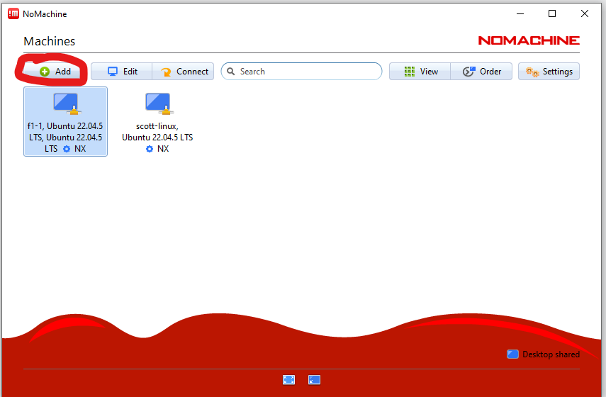
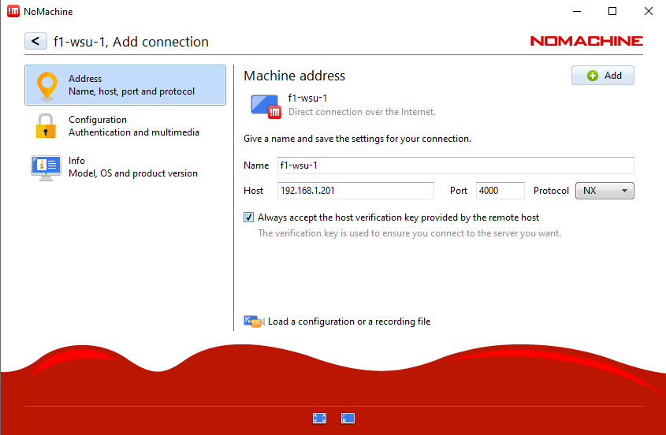
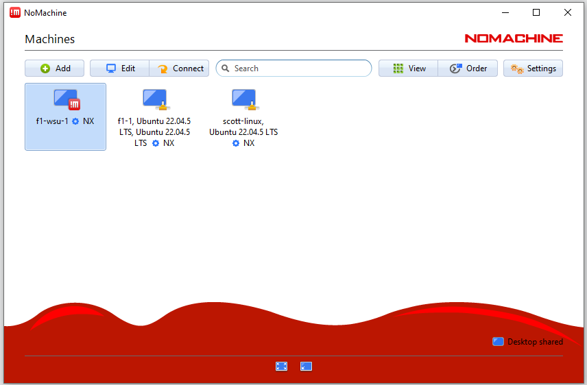
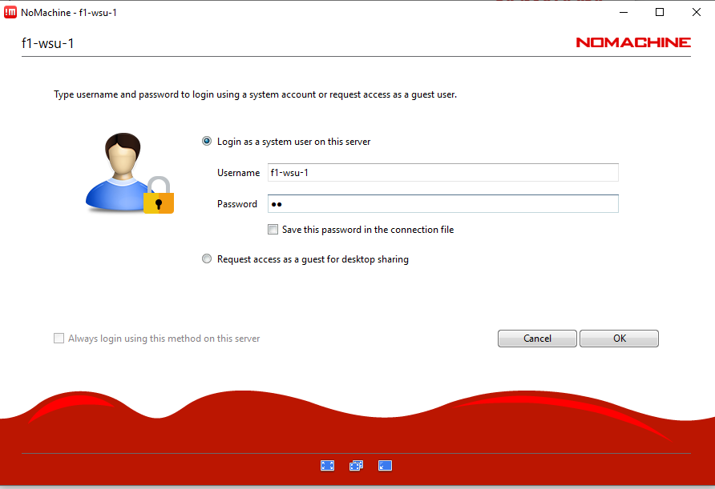
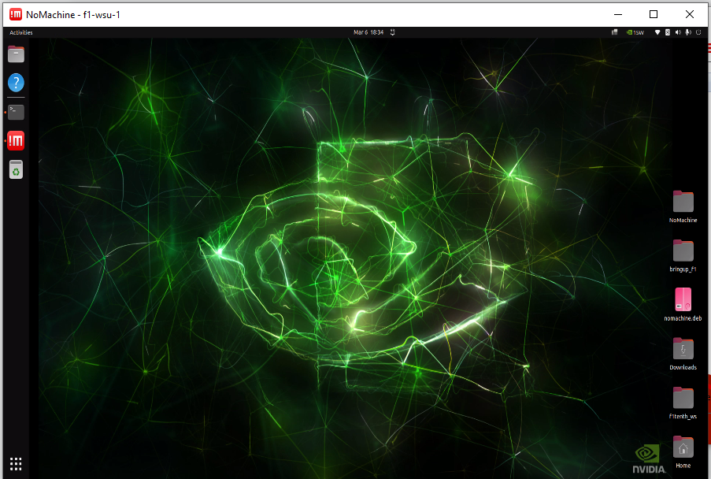

.. _doc_nomachine:

========================
WSU RoboRacer: NoMachine
========================

Install NoMachine on RoboRacer
==============================

.. code-block:: bash

   wget https://www.nomachine.com/free/arm/v8/deb -O nomachine.deb

Install using dpkg
------------------

.. code-block:: bash

   sudo dpkg -i nomachine.deb

Documentation
-------------

See the official NoMachine documentation:
`https://kb.nomachine.com/AR02R01074 <https://kb.nomachine.com/AR02R01074>`_

Install NoMachine on Host Machine (Ubuntu)
==========================================

Download NoMachine for Ubuntu:
`https://downloads.nomachine.com/download/?id=1 <https://downloads.nomachine.com/download/?id=1>`_

Install using dpkg
------------------

.. code-block:: bash

   cd ~/Downloads
   sudo dpkg -i nomachine_8.16.1_1_amd64.deb

Connect to RoboRacer
====================

On the host machine, open **NoMachine**.

Add a new connection
--------------------

Click on the **Add** button.

Configure the connection
------------------------

- Add the name of the bot  
- Add the IP address of the bot  
- Check **Always accept the host's verification**  
- Click **Add**

Select the RoboRacer
--------------------

Find the bot in the list of computers and select it.

Enter credentials
-----------------

Enter the credentials for the RoboRacer.

Connected
---------

You should now be connected to the RoboRacer desktop.

