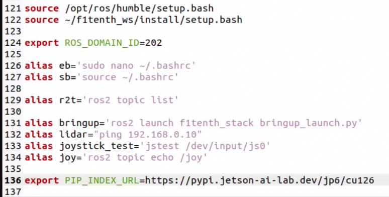

.. _doc_setup_opencv:

SETUP - OpenCV
==================================

Install pip

.. code-block:: bash

    sudo apt install python3-pip

Install Jetson Stats Package

.. code-block:: bash

    sudo pip install -U jetson-stats  

Reboot the Jetson Nano

.. code-block:: bash

    sudo reboot

Edit the .bashrc file to add the jeson-ai-lab file to the pip index

.. code-block:: bash

    gedit ~/.bashrc

Add the following line to the end of the file:

.. code-block:: c

    export PIP_INDEX_URL=https://pypi.jetson-ai-lab.io/jp6/cu126

Source the .bashrc file

.. code-block:: bash

    source ~/.bashrc

Install opencv python

.. code-block:: bash

    pip install opencv-python

Install dependencies

.. code-block:: bash

    sudo apt install libhdf5-dev
    sudo apt install libtesseract-dev
    sudo apt install libatlas-base-dev