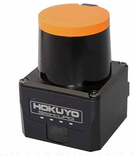

.. _doc_tutorials_aeb_scan:

LaserScan Data
==============

Before writing any code, it is important to understand what scan data is available and how it is structured. The following ROS 2 commands allow you to discover the ``/scan`` topic, inspect its message type, and explore the data used for Automatic Emergency Braking (AEB).

Finding the ``/scan`` Topic
---------------------------

First, confirm that the lidar scan topic exists.

.. code-block:: bash

   ros2 topic list
   ros2 topic list | grep scan

If ``/scan`` appears in the list, the lidar is publishing data and you are ready to proceed.

Checking the Message Type
-------------------------

Next, verify the type of message being published on ``/scan``.

.. code-block:: bash

   ros2 topic info /scan

You should see output similar to:

- ``Type: sensor_msgs/msg/LaserScan``

This tells us that scan data is published using the ``LaserScan`` message.

Inspecting the ``LaserScan`` Message Definition
-----------------------------------------------

To see what information is contained in each scan message:

.. code-block:: bash

   ros2 interface show sensor_msgs/msg/LaserScan

This is one of the most important steps. It shows all available fields, including:

- ``ranges[]`` – distance measurements in meters
- ``angle_min``, ``angle_max``, ``angle_increment`` – used to map array indices to angles
- ``range_min``, ``range_max`` – valid sensor distance limits
- ``header.frame_id`` – the coordinate frame of the scan data

Echoing Live Scan Data
----------------------

To view raw scan data as it is published:

.. code-block:: bash

   ros2 topic echo /scan

This produces a large amount of output. More student-friendly options include:

Show only a single scan message:

.. code-block:: bash

   ros2 topic echo /scan --once

Show a compact portion of the message:

.. code-block:: bash

   ros2 topic echo /scan --once | head -n 60

Understanding ``/scan`` Output (LaserScan)
------------------------------------------

The ``/scan`` topic publishes lidar data using the ``sensor_msgs/msg/LaserScan`` message. The most important field for Automatic Emergency Braking (AEB) is ``ranges[]`` — an array of distance measurements (in meters) taken at evenly spaced angles across the lidar’s field of view.

What ``ranges[]`` Means
~~~~~~~~~~~~~~~~~~~~~~~

- ``ranges[]`` is an array of distance readings in **meters**.
- Each element corresponds to one laser ray at a specific angle.
- The scan spans from ``angle_min`` to ``angle_max`` in steps of ``angle_increment``.

From the example output:

- ``angle_min = -2.356 rad``  (≈ **-135°**)
- ``angle_max =  2.356 rad``  (≈ **+135°**)
- ``angle_increment = 0.004363 rad`` (≈ **0.25° per sample**)

This results in approximately a **270° field of view**.

How Many Samples Are in One Scan?
~~~~~~~~~~~~~~~~~~~~~~~~~~~~~~~~~

The number of samples in ``ranges[]`` is approximately:

.. math::

   N \approx \frac{\text{angle\_max} - \text{angle\_min}}{\text{angle\_increment}} + 1

With the values above, this scan contains roughly **1081 distance measurements**.

Mapping an Index to an Angle
~~~~~~~~~~~~~~~~~~~~~~~~~~~~

Each index in ``ranges[]`` maps to an angle using:

.. math::

   \text{angle}(i) = \text{angle\_min} + i \cdot \text{angle\_increment}

- ``ranges[0]`` corresponds to ``angle_min`` (far left)
- ``ranges[last]`` corresponds to ``angle_max`` (far right)

"Straight Ahead" Index
~~~~~~~~~~~~~~~~~~~~~~

The index closest to straight ahead (0 radians) can be estimated by:

.. math::

   i_{\text{forward}} \approx \frac{0 - \text{angle\_min}}{\text{angle\_increment}}

For this scan, the forward-facing index is approximately **540**, near the center of the array.

Interpreting Range Values
~~~~~~~~~~~~~~~~~~~~~~~~~

- Values below **1 meter** indicate very close obstacles.
- Values between **1–3 meters** represent nearby objects.
- Readings of ``inf`` or values greater than ``range_max`` indicate no valid return.

In the example output, a value such as ``65.53`` exceeds ``range_max = 30.0`` and should be treated as **invalid** for AEB calculations.

Scan Timing and Health
----------------------

You can check how often scans are published:

.. code-block:: bash

   ros2 topic hz /scan

A higher scan rate allows faster reaction times for braking decisions.

You can also inspect bandwidth usage:

.. code-block:: bash

   ros2 topic bw /scan

This helps explain why ``ranges[]`` contains a large amount of data.

Confirming Frame Information
----------------------------

If you are working with angles or transforming scan data, it is important to know the coordinate frame.

.. code-block:: bash

   ros2 topic echo /scan --once | grep frame_id

This confirms the frame in which the scan data is reported and how it relates to the rest of the robot.

Hardware: Hokuyo UST-10LX LiDAR
--------------------------------

The ``/scan`` data you're working with comes from the **Hokuyo UST-10LX 2D LiDAR** sensor mounted on the RoboRacer vehicle. Understanding the hardware specifications helps you interpret the scan data and design effective safety systems.

|

.. note::

   **Manufacturer Information**

   Full specifications available at: `Hokuyo UST-10LX Product Page <https://hokuyo-usa.com/products/lidar-obstacle-detection/ust-10lx>`_

Key Specifications
~~~~~~~~~~~~~~~~~~

**Measurement Range**

- **Maximum Range**: 10 meters
- **Minimum Range**: 0.06 meters (60 mm)
- Values beyond these limits in ``ranges[]`` should be treated as invalid

**Field of View**

- **270° coverage** (approximately -135° to +135°)
- This wide field of view allows detection of obstacles to the sides as well as front
- Corresponds to the ``angle_min`` to ``angle_max`` values you see in the scan message

**Angular Resolution**

- **0.25° per measurement** (0.004363 radians)
- This is the ``angle_increment`` value
- Results in approximately **1081 distance measurements** per scan

**Scan Rate**

- **40 Hz** scanning frequency
- Provides scan updates 40 times per second
- Critical for real-time obstacle detection and emergency braking

**Accuracy**

- **±30 mm** under standard conditions
- Important when calculating precise time-to-collision values
- Range measurements are reliable within this tolerance

.. image:: img/10XL_specs.PNG
   :alt: Hokuyo UST-10LX Specifications
   :width: 70%
   :align: center

|

Physical Characteristics
~~~~~~~~~~~~~~~~~~~~~~~~

**Compact and Lightweight**

- **Dimensions**: 62 × 62 × 87 mm
- **Weight**: 130 g
- Minimal impact on vehicle dynamics

**Environmental Protection**

- **IP65-rated** enclosure
- Dustproof and water-resistant
- Suitable for indoor robotics environments

**Power and Communication**

- **12V DC** operation (~8W power consumption)
- **Ethernet interface** for high-speed data transfer to ROS 2
- Ensures low-latency scan data delivery

Connecting Hardware to Software
~~~~~~~~~~~~~~~~~~~~~~~~~~~~~~~~

When you subscribe to ``/scan``, you're receiving data that reflects these hardware characteristics:

- The ``ranges[]`` array length (~1081 elements) comes from the 270° FoV divided by 0.25° resolution
- The 40 Hz scan rate determines how quickly your AEB system can react
- The 10-meter max range defines the maximum detection distance for obstacles
- The ±30 mm accuracy affects the precision of your TTC calculations

Understanding these specifications helps you make informed decisions about:

- **Threshold values** for collision detection
- **Update rates** for your safety node
- **Valid range filtering** to exclude sensor noise or invalid readings

