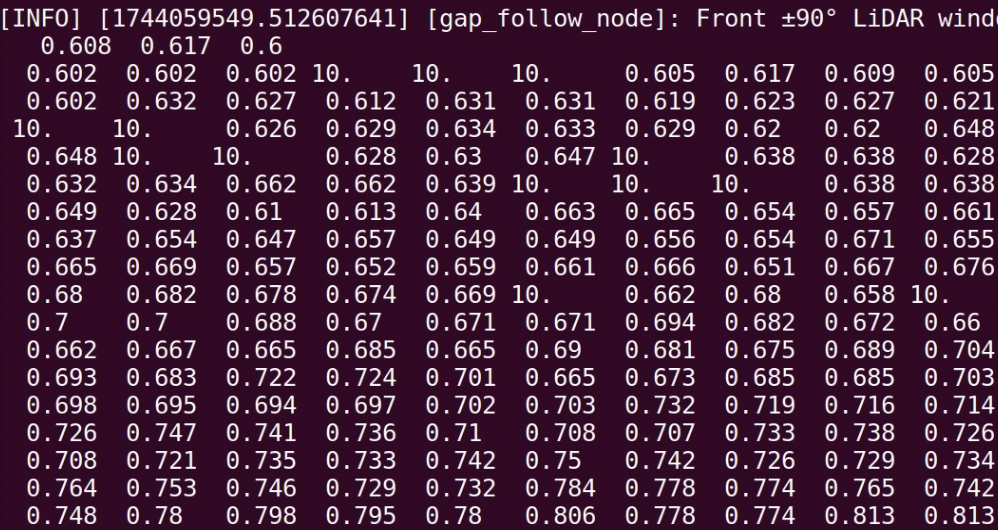

.. _doc_tutorials_gap_preprocess_lidar:

Preprocessing LiDAR Data
========================

This page describes the implementation of the ``preprocess_lidar`` function, which is essential for preparing LiDAR sensor data before further analysis, such as gap detection.

Why Preprocess?
---------------

LiDAR sensors often produce data that include noisy or invalid values such as:

- **Infinite values (inf)**: Indicate measurements beyond the sensor's maximum range.
- **Not-a-Number values (NaN)**: Result from failed sensor measurements.
- **Extreme values**: Measurements that are too close or too far, beyond practical use.

Preprocessing ensures the reliability and accuracy of your navigation algorithms.

Detailed Implementation
-----------------------

Below is the Python implementation of the LiDAR preprocessing function, broken down with detailed comments for clarity:

.. code-block:: python

   import numpy as np

   def preprocess_lidar(self, ranges, min_range=0.05, max_range=10.0):
           """
           Preprocess the LiDAR scan array. Preprocessing steps may include:

               1. Clipping maximum range values
               2. Handling NaN or inf values
               3. (Optional) Smoothing (e.g., moving average)

           Args:
               ranges (list): Raw LiDAR distance readings

           Returns:
               np.array: Cleaned and processed LiDAR distances
           """

           # Convert incoming ranges list to a numpy array for efficient processing
           processed_ranges = np.array(ranges, dtype=np.float32)

           # 1. Clip values that are too far ( > 10 meters) to maximum distance
           #    Clip values that are too close( < .05 meters) to min distance
           processed_ranges = np.clip(processed_ranges, min_range, max_range)

           # 2. Replace NaN values (failed sensor measurements) with MAX_RANGE
           processed_ranges[np.isnan(processed_ranges)] = max_range

           # 2. Replace infinite values (measurements beyond sensor range) with MAX_RANGE
           processed_ranges[np.isinf(processed_ranges)] = max_range

           # Optional TODO: 3. Apply smoothing (e.g., moving average) if desired

           # Return the cleaned and processed LiDAR range data
           return processed_ranges

Usage
-----

This function should be called every time new LiDAR data is received, typically at the start of your scan callback function.

Example usage in the ``scan_callback``:

.. code-block:: python

   def scan_callback(self, msg):
       processed_ranges = self.preprocess_lidar(msg.ranges)
       # Continue with gap detection logic...

**Example: Changing NaN and inf to 10m**

|

Proper preprocessing enhances your gap-following algorithm's reliability by ensuring it operates on clean, valid data.

(Optional) Smoothing
--------------------

In addition to cleaning NaN and infinite values, another important preprocessing step is **smoothing**.
Smoothing helps to eliminate small noisy spikes in LiDAR data while preserving the important obstacle structures.

Why Apply Smoothing?
~~~~~~~~~~~~~~~~~~~~

- Real-world LiDAR sensors introduce small random noise into distance measurements.
- Smoothing **removes small, isolated errors** and **makes obstacle shapes cleaner**.
- Helps **gap-finding algorithms** perform more reliably.

Moving Average Smoothing (Simple Concept)
~~~~~~~~~~~~~~~~~~~~~~~~~~~~~~~~~~~~~~~~~~

We replace each LiDAR distance with the **average of itself and its neighbors**.

.. list-table::
   :header-rows: 1
   :widths: 40 60

   * - Example
     - Moving Average (Window = 3)
   * - ``[1.0, 2.0, 100.0, 2.0, 1.0]``
     - ``[1.0, 34.3, 34.7, 34.3, 1.0]``

Notice how the 100.0 spike gets blended smoothly!

Python Code: Smoothing with Convolution
~~~~~~~~~~~~~~~~~~~~~~~~~~~~~~~~~~~~~~~~

The most efficient way to apply moving average smoothing is using **np.convolve**:

.. code-block:: python

   import numpy as np

   def smooth_lidar(self, ranges, window_size=5):
       """
       Apply moving average smoothing to LiDAR scan data using convolution.

       Args:
           ranges (np.array): Raw or preprocessed LiDAR ranges
           window_size (int): Size of the smoothing window (must be odd)

       Returns:
           np.array: Smoothed LiDAR ranges
       """
       if window_size < 3:
           return ranges  # Skip if window too small to matter

       kernel = np.ones(window_size) / window_size  # Create a normalized averaging kernel
       smoothed = np.convolve(ranges, kernel, mode='same')  # Convolve while preserving array size

       return smoothed

✅ This function automatically smooths your LiDAR data across a sliding window.

How Smoothing Fits into Preprocessing
~~~~~~~~~~~~~~~~~~~~~~~~~~~~~~~~~~~~~~

You would call smoothing **after**:

1. Replacing NaN values
2. Replacing infinite values
3. Clipping maximum and minimum distances

Example inside ``preprocess_lidar``:

.. code-block:: python

   proc_ranges = self.smooth_lidar(proc_ranges, window_size=5)

Why Convolution?
~~~~~~~~~~~~~~~~

.. list-table::
   :header-rows: 1
   :widths: 50 50

   * - Manual Loop
     - Convolution
   * - Slower, more code
     - Faster, very clean
   * - Harder to debug
     - Optimized and easy
   * - Not used in real systems
     - Common professional method

✅ **Convolution** is the professional way to smooth sensor data efficiently!

Tip: Choosing Window Size
~~~~~~~~~~~~~~~~~~~~~~~~~~

.. list-table::
   :header-rows: 1
   :widths: 30 70

   * - Window Size
     - Behavior
   * - 3
     - Light smoothing
   * - 5
     - Good balance (recommended)
   * - 7+
     - Heavy smoothing (may blur obstacles)

.. note::

   **For most robots**, a window size of **5** works well.
   Only increase if your sensor is extremely noisy!

Before vs After Example
~~~~~~~~~~~~~~~~~~~~~~~~

.. code-block:: text

   Raw Scan:
   [1.0, 2.0, 100.0, 2.0, 1.0]

   After Smoothing:
   [1.0, 34.3, 34.7, 34.3, 1.0]

- Sharp spikes are smoothed out.
- Obstacle shapes are preserved!

✅ Now your robot can operate on **clean, reliable** LiDAR data — and your algorithms will work much better!
