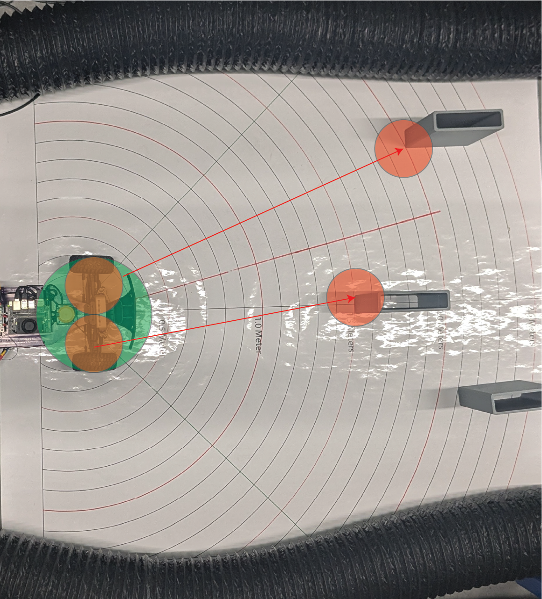

.. _doc_tutorials_gap_obstacle_masking:

Obstacle Masking: Creating a Safety Bubble
===========================================

Before we find gaps to drive through, we must ensure that the robot **doesn't hit obstacles**.
We create a **Safety Bubble** — an area around the closest detected object where driving is not allowed.

|

🛠 Why Create a Safety Bubble?
-------------------------------

- The car needs **clear space** to steer safely.
- Obstacles might not be exactly at one point — their edges could extend sideways.
- Sensors have small errors, so **being conservative** around obstacles improves safety.

✅ By removing all directions near obstacles, we **only drive through clean, safe spaces**.

📈 What the Data Looks Like
----------------------------

Imagine your LiDAR scan (distances around the robot) like this:

.. code-block:: text

   [2.5m, 2.5m, 0.6m, 0.6m, 2.5m, 2.5m]

- The **0.6m values** indicate a close obstacle.
- We create a **bubble** around it by setting nearby points to **zero**.

After applying the safety bubble:

.. code-block:: text

   [2.5m, 0.0m, 0.0m, 0.0m, 2.5m, 2.5m]

Now we clearly **cannot steer toward the obstacle**!

✏️ Safety Bubble Method (Skeleton Code)
----------------------------------------

.. code-block:: python

   def create_safety_bubble(self, ranges, bubble_radius):
       """
       Masks out a 'bubble' around the closest obstacle in LiDAR data.

       Args:
           ranges (np.array): Preprocessed LiDAR distances
           bubble_radius (float): Radius of safety bubble (meters)

       Returns:
           np.array: Updated ranges with obstacles masked
       """
       closest_idx = np.argmin(ranges)  # Find the nearest object
       closest_dist = ranges[closest_idx]

       if closest_dist == 0.0:
           return ranges  # No need to create a bubble if no valid close point

       bubble_angle = math.atan(bubble_radius / closest_dist)  # Calculate angle span of the bubble
       bubble_points = int(bubble_angle / self.angle_increment)  # How many LiDAR points wide the bubble is

       start_idx = max(closest_idx - bubble_points, 0)
       end_idx = min(closest_idx + bubble_points, len(ranges) - 1)

       # Set the bubble area to obstacle (zero)
       ranges[start_idx:end_idx + 1] = 0.0

       return ranges

⚙️ How It Works Step-by-Step
-----------------------------

.. list-table::
   :header-rows: 1
   :widths: 10 90

   * - Step
     - Action
   * - 1.
     - Find the closest detected object.
   * - 2.
     - Calculate how many degrees (or LiDAR points) the bubble should cover.
   * - 3.
     - Mask out all points in that range by setting them to zero.
   * - 4.
     - Treat zeroed points as **unsafe directions** during gap finding.

🧠 Why Mask Points to Zero?
----------------------------

- **Zero = obstacle** in later steps.
- When finding free space, we **only look at non-zero points**.
- Simple, fast, and reliable method for safe navigation.

🚀 Key Parameters
------------------

.. list-table::
   :header-rows: 1
   :widths: 30 30 40

   * - Parameter
     - Meaning
     - Recommended Value
   * - ``bubble_radius``
     - Radius of safety margin (meters)
     - 0.3m – 0.5m depending on robot size

✅ Larger robots need larger bubbles!

📚 Summary
----------

- **Obstacle masking** protects the vehicle from driving dangerously close to obstacles.
- A **safety bubble** around the nearest obstacle creates a clear zone of avoidance.
- This step is critical before detecting the largest navigable gap.

✅ Always apply the safety bubble **before** finding free space!
