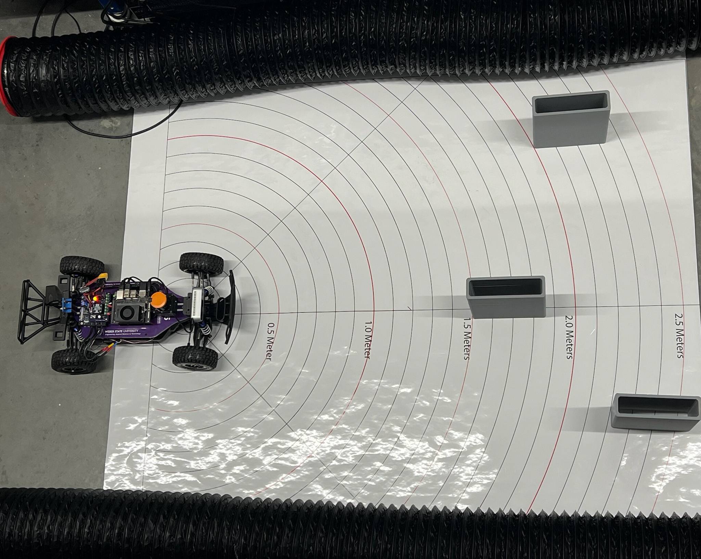
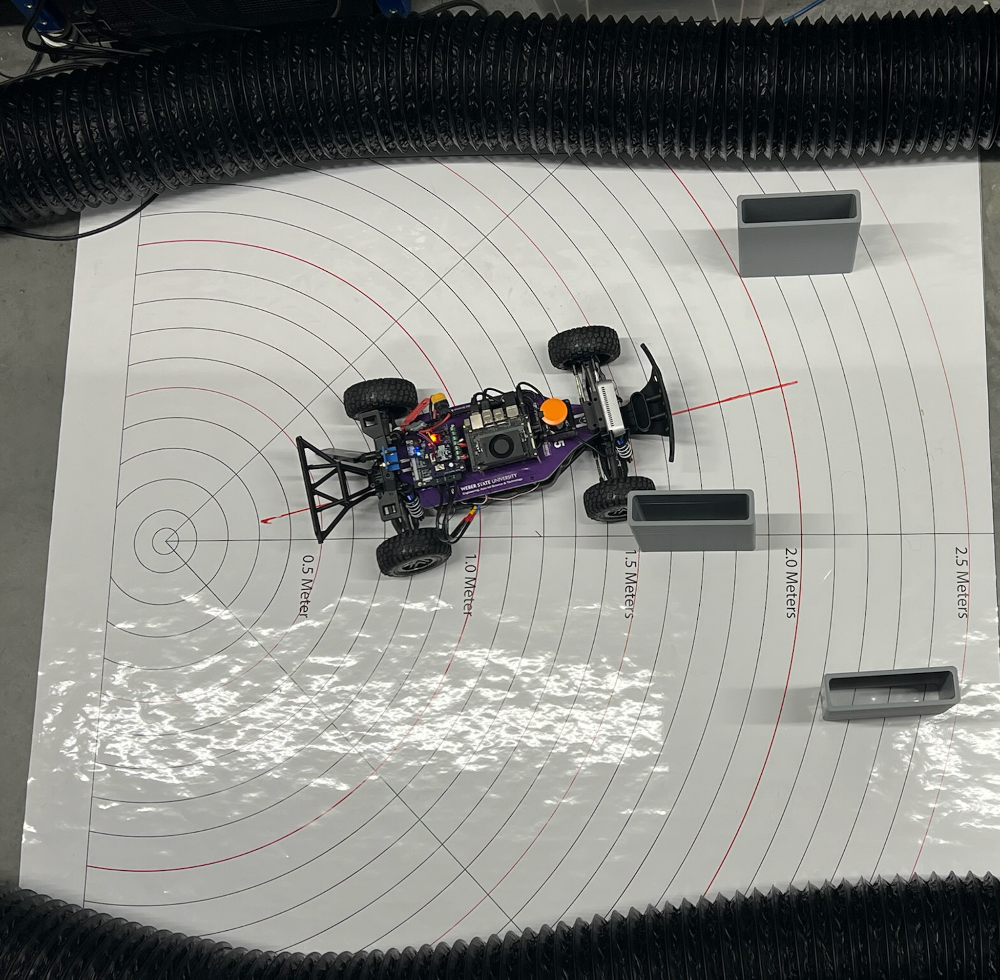

.. _doc_tutorials_gap_following_theory:

Follow the Gap Method
=====================

In the context of F1TENTH racing, the **Follow the Gap** method refers to an obstacle avoidance and path-planning algorithm designed to quickly identify the largest navigable opening (or "gap") and steer the vehicle toward it.

Core Concept
------------

- **Identify Obstacles**: The vehicle uses LiDAR data to detect obstacles around it.
- **Finding Gaps**: It analyzes the LiDAR scan points to identify free space (or gaps) that are large enough for the car to safely pass through.
- **Selecting the Largest Gap**: Among the available gaps, the largest one is chosen to ensure safety and maximize maneuverability.
- **Choosing a Point within the Gap**: Typically, the safest route is through the middle of the largest gap, so the vehicle aims for that midpoint.

|

|

.. image:: img/gap3.jpg
   :alt: Gap Finding Step 3
   :width: 60%
   :align: center

|

Step-by-Step Process
---------------------

1️⃣ Data Acquisition
~~~~~~~~~~~~~~~~~~~

- Receive a **full 360° LiDAR scan** (``LaserScan`` message).
- For the Hokuyo LiDAR, **flip the scan** if necessary to match intuitive left-to-right ordering.
- (Optional) Focus on a **front window** (e.g., ±90°), but default is to use the **full scan**.

2️⃣ Preprocessing
~~~~~~~~~~~~~~~~

- **Clean the raw LiDAR ranges**:
  - Replace **NaN** values with maximum range.
  - Replace **infinite** values with maximum range.
  - **Clip** distances to be within a realistic minimum/maximum range.
- (Optional) **Apply smoothing** (e.g., moving average) to reduce small noise spikes.

3️⃣ Obstacle Masking (Safety Bubble)
~~~~~~~~~~~~~~~~~~~~~~~~~~~~~~~~~~~~

- **Find the closest obstacle** in the LiDAR scan.
- **Create a safety bubble** around the closest obstacle:
  - Set all ranges inside the bubble radius to **zero** (obstacle).
  - This eliminates unsafe directions close to collisions.

4️⃣ Gap Detection
~~~~~~~~~~~~~~~~

- Treat **non-zero regions** in the processed ranges as **free space**.
- **Find the longest continuous sequence** of non-zero points:
  - This is the **largest navigable gap**.

5️⃣ Best Point Selection Within the Gap
~~~~~~~~~~~~~~~~~~~~~~~~~~~~~~~~~~~~~~~

- Two options:
 
  - **Farthest Point Method**:
    Select the furthest reachable point in the gap.
  - **Disparity Method**:
    Detect edges (sudden changes in distance) and **steer between obstacles** using disparities for smarter behavior.
- Both methods output a **best point index** to steer toward.

6️⃣ Navigation Command
~~~~~~~~~~~~~~~~~~~~~

- Calculate the **steering angle**:
  - Based on the angular difference between the car's center and the best point.
- (Optional) Adjust **speed proportionally**:
  - **Lower speed** for large steering angles (tight turns).
  - **Higher speed** for small steering angles (straight).
- Publish an **AckermannDriveStamped** message with the calculated steering and speed.

Practical Considerations
-------------------------

- Adjusting safety margins based on the speed and agility of the vehicle.
- Fine-tuning the method to handle narrow paths or cluttered environments.
- Accounting for dynamic obstacles by rapidly updating LiDAR scans and re-computing gaps.

Advantages
----------

- Simple, fast, and computationally efficient, making it suitable for real-time systems.
- Effective in unknown and cluttered environments.

Limitations
-----------

- May lead to oscillations or suboptimal paths in complex scenarios.
- Doesn't inherently incorporate global path planning.

**UNC Follow the Gap - Demonstration**

.. raw:: html

   <iframe width="560" height="315"
       src="https://www.youtube.com/embed/ctTJHueaTcY"
       title="UNC Follow the Gap Video"
       frameborder="0" allow="accelerometer; autoplay; clipboard-write; encrypted-media; gyroscope; picture-in-picture" allowfullscreen>
   </iframe>
