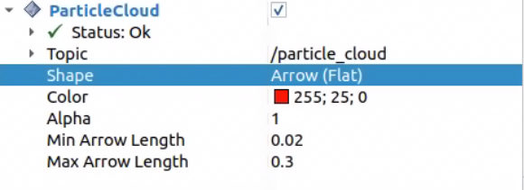
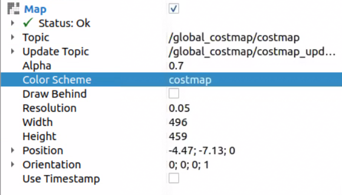
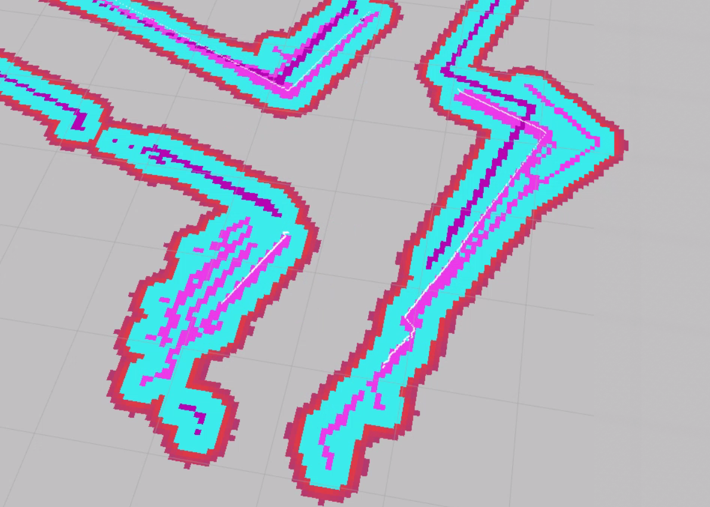
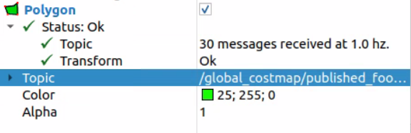
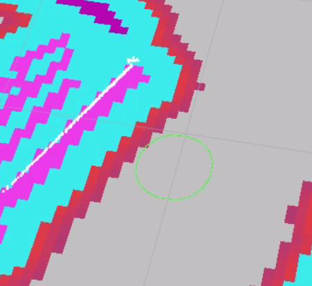

.. _doc_tutorials_nav2_goal_pose:

2D Goal Pose Navigation
========================

Send the car to any point on the map using the 2D Goal Pose tool in RViz2.

Before starting, make sure all previous terminals (SLAM, map server, old RViz2) are closed. This tutorial launches everything fresh so the map is loaded cleanly by Nav2.

Steps
-----

1️⃣ Start Bringup (Terminal 1)
^^^^^^^^^^^^^^^^^^^^^^^^^^^^^^^

Make sure the PlayStation controller is connected to the car, then open a terminal on the robot and run:

.. code-block:: bash

   bringup

This calls ``ros2 launch f1tenth_stack bringup_launch.py``, which starts the car's sensors and drivers.

.. note::

   If Nav2 later reports ``Timed out waiting for transform from base_link to odom``, the PlayStation controller is likely not connected. The VESC driver requires the joystick to fully initialize, and without it the ``odom`` frame is never published.

.. warning::

   **Hold R1 for autonomous mode.** By default the joystick continuously publishes zero-speed commands at high priority, blocking Nav2. Hold **R1** (button 5) on the PlayStation controller to enable autonomous mode — this lets Nav2's drive commands through. Releasing R1 returns to manual joystick control.

Leave this terminal running.

2️⃣ Launch Nav2 (Terminal 2)
^^^^^^^^^^^^^^^^^^^^^^^^^^^^^

Open a **new** terminal and source the workspace:

.. code-block:: bash

   cd ~/f1tenth_ws
   source /opt/ros/humble/setup.bash
   source install/setup.bash

Launch the full Nav2 stack:

.. code-block:: bash

   ros2 launch f1tenth_stack nav2_launch.py

Leave this terminal running.

3️⃣ Open RViz2
^^^^^^^^^^^^^^^^

Open a new terminal on the RoboRacer and launch RViz2:

.. code-block:: bash

   source /opt/ros/humble/setup.bash
   rviz2

Add a **Map** display (Topic: ``/map``, Durability Policy: ``Transient Local``) to confirm the map is visible.

4️⃣ Set Initial Pose
^^^^^^^^^^^^^^^^^^^^^^

Before Nav2 can navigate, AMCL needs to know where the car is on the map.

- In the RViz2 toolbar, click **2D Pose Estimate**
- Click on the map at the car's approximate location
- Drag to set the car's heading, then release

You should see the robot's position update on the map. AMCL will refine the estimate as the car moves.

5️⃣ Add Visualization Displays
^^^^^^^^^^^^^^^^^^^^^^^^^^^^^^^^

In RViz2, add the following displays to visualize Nav2's planning, localization, and obstacle avoidance.

**AMCL Particle Cloud** (localization confidence):

- Click **Add** → **By topic** → expand ``/particle_cloud`` → select **ParticleCloud** (under ``nav2_rviz_plugins``)
- The topic is set automatically

A tight cluster of arrows means AMCL is confident in its localization. A spread-out cloud means it is still converging.

**Global Costmap** (obstacle avoidance zones):

- Click **Add** → select **Map**
- Set Topic to ``/global_costmap/costmap``
- Change **Color Scheme** to ``costmap`` (this uses a gradient that highlights inflation zones)

The costmap is Nav2's view of the world for planning purposes. It takes your saved map and **inflates obstacles outward** — creating purple/blue "danger zones" around walls and objects. The planner avoids these zones so the car never plans a path too close to a wall. The local costmap (``/local_costmap/costmap``) also incorporates **live LiDAR data**, allowing Nav2 to detect and avoid obstacles that weren't in the original map (e.g., a person standing in the hallway).

**Global Costmap Polygon** (robot footprint):

- Click **Add** → **By topic** → expand ``/global_costmap`` → expand ``/global_costmap/published_footprint`` → select **Polygon**
- The topic is set automatically

The polygon shows the robot's footprint on the costmap — this is the outline Nav2 uses to determine whether the car fits through a gap or will collide with an inflated obstacle.

**Global Plan** (the planned route from start to goal):

- Click **Add** → select **Path**
- Set Topic to ``/plan``

**Local Plan** (the path the controller is currently following):

- Click **Add** → select **Path**
- Set Topic to ``/local_plan``

**Waypoint Markers** (Nav2 internal markers):

- Click **Add** → select **MarkerArray**
- Set Topic to ``/waypoints``

6️⃣ Send a 2D Goal Pose
^^^^^^^^^^^^^^^^^^^^^^^^^

- In the RViz2 toolbar, click **2D Goal Pose**
- Click on the map at the destination
- Drag to set the desired heading, then release

The planned path will appear on the map and the car will begin driving toward the goal.

7️⃣ Watch the Car Navigate
^^^^^^^^^^^^^^^^^^^^^^^^^^^

- The global planner computes a path from the car's current pose to the goal
- The controller follows that path in real time — watch the ``/local_plan`` display to see the controller's tracking path
- The car will stop when it reaches the goal

.. image:: img/2d_pose_estimate.gif
   :alt: Setting the initial pose and sending a 2D Goal Pose in RViz2

.. note::

   If the car does not move after setting a goal, confirm that:

   - You set the initial pose with **2D Pose Estimate** (step 4️⃣)
   - You are holding **R1** (button 5) on the PlayStation controller to enable autonomous mode
   - Nav2 lifecycle nodes are all active (check ``ros2 node list``)
   - The ``/goal_pose`` topic is being published (check ``ros2 topic echo /goal_pose``)
   - The map is visible in RViz2 (set Durability Policy to ``Transient Local``)

Topics
------

.. list-table::
   :header-rows: 1
   :widths: 30 30 40

   * - Topic
     - Type
     - Description
   * - ``/goal_pose``
     - ``geometry_msgs/PoseStamped``
     - Published by RViz2 when you click 2D Goal Pose
   * - ``/plan``
     - ``nav_msgs/Path``
     - Global path planned by Nav2
   * - ``/local_plan``
     - ``nav_msgs/Path``
     - Local path the controller is currently following
   * - ``/waypoints``
     - ``visualization_msgs/MarkerArray``
     - Nav2 internal waypoint markers
   * - ``/cmd_vel``
     - ``geometry_msgs/Twist``
     - Velocity commands sent to the car by the controller
