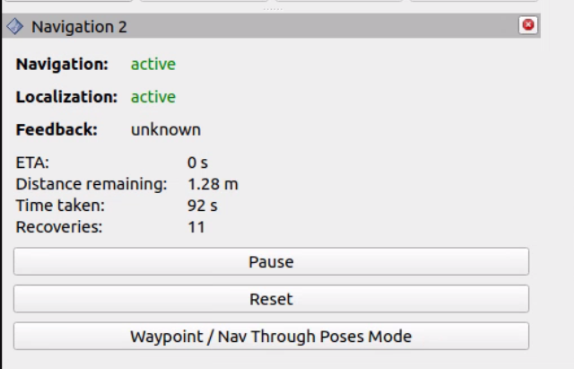
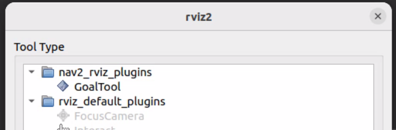
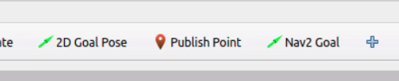
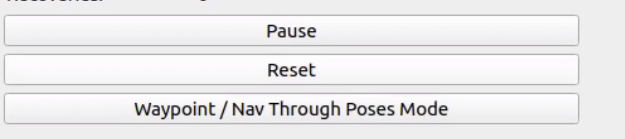
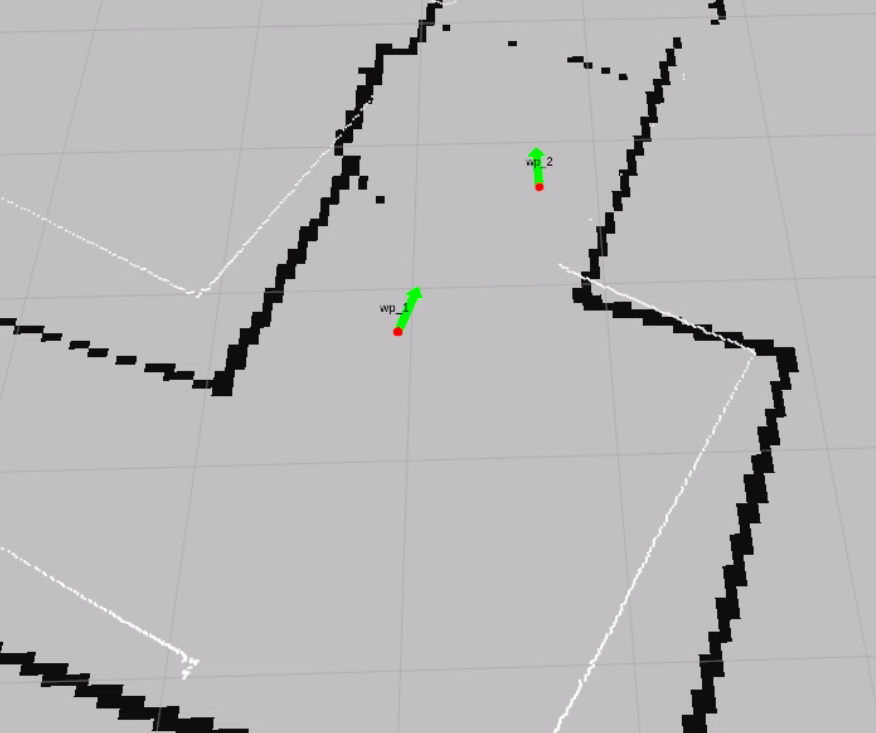
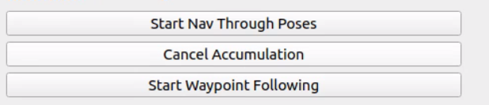

.. _doc_tutorials_nav2_waypoint_nav:

Navigate Through Poses
=======================

Send the car through multiple waypoints in sequence using the Nav2 panel in RViz2.

In the previous tutorial you sent a single 2D Goal Pose. Here you will queue up several waypoints on the map and have Nav2 drive the car through all of them in order.

Before starting, make sure all previous terminals are closed. This tutorial launches everything fresh.

Steps
-----

1️⃣ Start Bringup (Terminal 1)
^^^^^^^^^^^^^^^^^^^^^^^^^^^^^^^

Make sure the PlayStation controller is connected to the car, then open a terminal on the robot and launch the car's sensors and drivers:

.. code-block:: bash

   cd ~/f1tenth_ws
   source /opt/ros/humble/setup.bash
   source install/setup.bash

.. code-block:: bash

   ros2 launch f1tenth_stack bringup_launch.py

Or, if you have the alias configured: ``bringup``

.. note::

   If Nav2 later reports ``Timed out waiting for transform from base_link to odom``, the PlayStation controller is likely not connected. The VESC driver requires the joystick to fully initialize, and without it the ``odom`` frame is never published.

.. warning::

   **Hold R1 for autonomous mode.** By default the joystick continuously publishes zero-speed commands at high priority, blocking Nav2. Hold **R1** (button 5) on the PlayStation controller to enable autonomous mode — this lets Nav2's drive commands through. Releasing R1 returns to manual joystick control.

Leave this terminal running.

2️⃣ Launch Nav2 (Terminal 2)
^^^^^^^^^^^^^^^^^^^^^^^^^^^^^

Open a **new** terminal and source the workspace:

.. code-block:: bash

   cd ~/f1tenth_ws
   source /opt/ros/humble/setup.bash
   source install/setup.bash

Launch the full Nav2 stack:

.. code-block:: bash

   ros2 launch f1tenth_stack nav2_launch.py map_name:=hallway_map

Leave this terminal running.

3️⃣ Open RViz2
^^^^^^^^^^^^^^^^

Open a new terminal on the RoboRacer and launch RViz2:

.. code-block:: bash

   source /opt/ros/humble/setup.bash
   rviz2

Add a **Map** display (Topic: ``/map``, Durability Policy: ``Transient Local``) to confirm the map is visible.

4️⃣ Set Initial Pose
^^^^^^^^^^^^^^^^^^^^^^

Before Nav2 can navigate, AMCL needs to know where the car is on the map.

- In the RViz2 toolbar, click **2D Pose Estimate**
- Click on the map at the car's approximate location
- Drag to set the car's heading, then release

You should see the robot's position update on the map. AMCL will refine the estimate as the car moves.

5️⃣ Add Path Visualization
^^^^^^^^^^^^^^^^^^^^^^^^^^^

In RViz2, add the following displays:

- Click **Add** → select **Path** → set Topic to ``/plan``
- Click **Add** → select **Path** → set Topic to ``/local_plan``
- Click **Add** → select **MarkerArray** → set Topic to ``/waypoints``

6️⃣ Add the Nav2 Panel
^^^^^^^^^^^^^^^^^^^^^^^^

In RViz2, open **Panels** → **Add New Panel** → select **Nav2** (from ``nav2_rviz_plugins``).

A new panel will appear at the bottom of RViz2 with navigation controls.

7️⃣ Add the Nav2 Goal Tool
^^^^^^^^^^^^^^^^^^^^^^^^^^^^^

The default **2D Goal Pose** button sends goals immediately. To queue waypoints, you need the **Nav2 Goal** tool instead.

In the RViz2 toolbar, click the **+** button (next to the 2D Goal Pose button) to add a new tool. Select **GoalTool** under ``nav2_rviz_plugins``, then click **OK**.

A new **Nav2 Goal** button will appear in the toolbar.

8️⃣ Enable Waypoint Mode
^^^^^^^^^^^^^^^^^^^^^^^^^^

In the Nav2 panel at the bottom of RViz2, click the **Waypoint / Nav Through Poses Mode** button.

This changes the behavior of the **Nav2 Goal** tool — instead of sending each goal immediately, it will queue waypoints for batch navigation.

9️⃣ Set Waypoints
^^^^^^^^^^^^^^^^^^^

Use the **Nav2 Goal** tool in the RViz2 toolbar to place multiple waypoints on the map:

- Click on the map at the first waypoint location, drag to set heading, release
- Repeat for each additional waypoint
- Each waypoint appears as a numbered marker on the map

Place 3–5 waypoints around the track to start. Each waypoint is labeled (wp_1, wp_2, etc.) on the map.

🔟 Start Navigation
^^^^^^^^^^^^^^^^^^^^^^

In the Nav2 panel, click **Start Nav Through Poses**.

The car will begin driving through each waypoint in the order you placed them. The global planner computes a path to each waypoint in sequence, and the controller follows each path segment.

1️⃣1️⃣ Watch the Car Navigate
^^^^^^^^^^^^^^^^^^^^^^^^^^^^^^

- The car drives to the first waypoint, then replans to the next
- Watch the ``/plan`` and ``/local_plan`` displays update as the car progresses
- The car stops after reaching the final waypoint

.. note::

   If the car does not move after clicking Start Nav Through Poses, confirm that:

   - You set the initial pose with **2D Pose Estimate** (step 4️⃣)
   - You are holding **R1** (button 5) on the PlayStation controller to enable autonomous mode
   - Nav2 lifecycle nodes are all active (check ``ros2 node list``)
   - You placed at least one waypoint before clicking start
   - The map is visible in RViz2 (set Durability Policy to ``Transient Local``)

   To clear all waypoints and start over, click **Cancel** in the Nav2 panel, then place new waypoints.

Topics
------

.. list-table::
   :header-rows: 1
   :widths: 30 30 40

   * - Topic
     - Type
     - Description
   * - ``/plan``
     - ``nav_msgs/Path``
     - Global path planned by Nav2 (updates for each waypoint segment)
   * - ``/local_plan``
     - ``nav_msgs/Path``
     - Local path the controller is currently following
   * - ``/waypoints``
     - ``visualization_msgs/MarkerArray``
     - Waypoint markers shown on the map
   * - ``/cmd_vel``
     - ``geometry_msgs/Twist``
     - Velocity commands sent to the car by the controller
