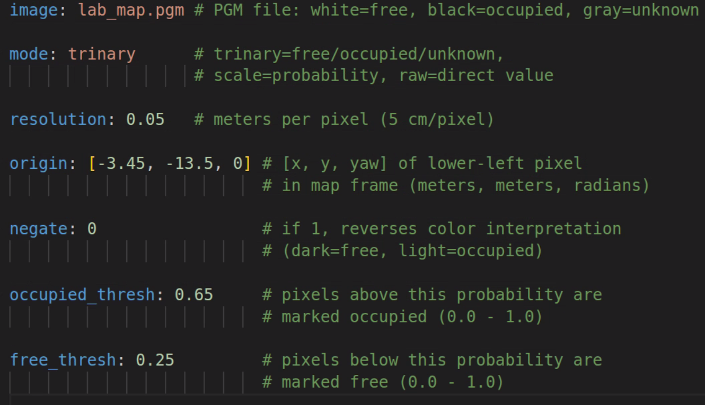
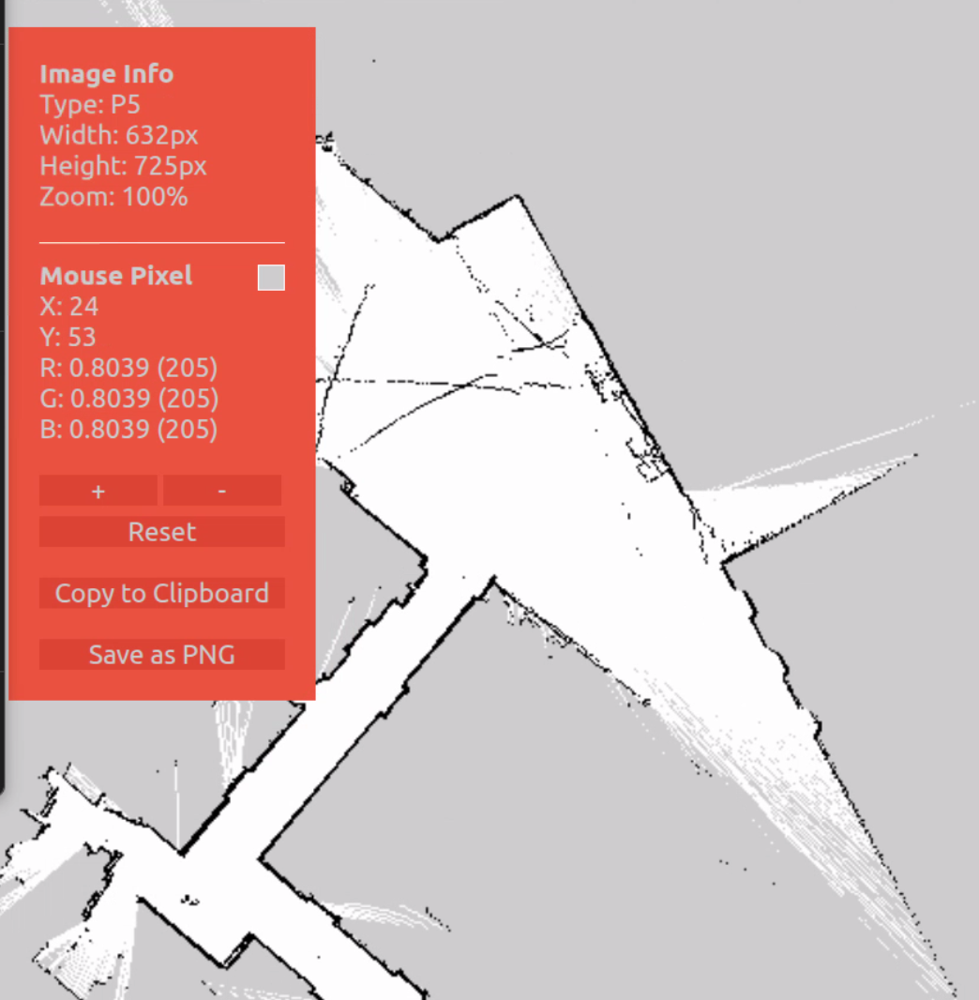
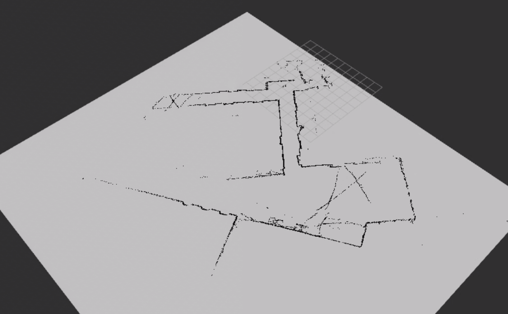

.. _doc_tutorials_slam_map:

Saving the Map
==============

Once you have finished building your map with SLAM Toolbox, you must save it for later use in localization or navigation.

🎥 Video Walkthrough
--------------------

.. raw:: html

   <iframe width="560" height="315"
     src="https://www.youtube.com/embed/RanGbHii2m8"
     title="YouTube video player"
     frameborder="0"
     allow="accelerometer; autoplay; clipboard-write; encrypted-media; gyroscope; picture-in-picture; web-share"
     allowfullscreen></iframe>

|

⚠️ Important
------------

- The car must remain powered on while saving.
- SLAM Toolbox must still be running.
- Do **not** close the SLAM terminal before saving the map.

Steps to Save the Map
---------------------

1️⃣ Finish Driving the Map  
^^^^^^^^^^^^^^^^^^^^^^^^^^

- Drive the vehicle through the entire area.
- Make sure the loop is closed if possible.
- Verify the map looks complete in RViz2.

2️⃣ Open a New Terminal  
^^^^^^^^^^^^^^^^^^^^^^^^

Open a new terminal on the RoboRacer:

.. code-block:: bash

   cd ~/f1tenth_ws
   source /opt/ros/humble/setup.bash
   source install/setup.bash

3️⃣ Save the Map
^^^^^^^^^^^^^^^^^

In ROS 2 Humble, use the ``nav2_map_server`` package to save the map. Save it directly into the stack's maps folder to avoid any extra move steps.

First, create the maps directory in the stack (if it does not already exist):

.. code-block:: bash

   mkdir -p ~/f1tenth_ws/src/f1tenth_system/f1tenth_stack/maps

Then run the map saver command, saving directly into that folder:

.. code-block:: bash

   ros2 run nav2_map_server map_saver_cli -f ~/f1tenth_ws/src/f1tenth_system/f1tenth_stack/maps/lab_map

.. note::

   If you see ``Failed to spin map subscription``, the map saver could not find the ``/map`` topic. If SLAM Toolbox is still running, try the save command again — it sometimes fails on the first attempt. If SLAM Toolbox was closed, you will need to restart it and rebuild the map before saving.

This will generate two files:

.. code-block:: text

   ~/f1tenth_ws/src/f1tenth_system/f1tenth_stack/maps/lab_map.pgm
   ~/f1tenth_ws/src/f1tenth_system/f1tenth_stack/maps/lab_map.yaml

- ``.pgm`` — grayscale occupancy grid image
- ``.yaml`` — metadata (resolution, origin, thresholds)

|

4️⃣ Verify the Map Was Saved
^^^^^^^^^^^^^^^^^^^^^^^^^^^^^^

Check that both files exist:

.. code-block:: bash

   ls ~/f1tenth_ws/src/f1tenth_system/f1tenth_stack/maps/

You should see:

.. code-block:: text

   lab_map.pgm
   lab_map.yaml

Then open the yaml file and confirm the ``image:`` field matches the ``.pgm`` filename exactly:

.. code-block:: bash

   cat ~/f1tenth_ws/src/f1tenth_system/f1tenth_stack/maps/lab_map.yaml

You should see a line like:

.. code-block:: text

   image: lab_map.pgm

Understanding the YAML Thresholds
^^^^^^^^^^^^^^^^^^^^^^^^^^^^^^^^^^^

The ``.pgm`` file stores each pixel as a grayscale value (0–255). When the map server loads the map, it converts each pixel to an occupancy probability (0.0–1.0) and classifies it using the thresholds in the ``.yaml`` file:

- **probability > occupied_thresh** → occupied (wall / obstacle)
- **probability < free_thresh** → free (drivable space)
- **anything in between** → unknown

The pixel values in the ``.pgm`` are fixed from when SLAM created the map, but you can adjust the thresholds in the ``.yaml`` to change how those pixels get classified:

.. list-table::
   :header-rows: 1
   :widths: 35 15 50

   * - Parameter
     - Default
     - Effect of Changing
   * - ``occupied_thresh``
     - ``0.65``
     - Raising → fewer cells marked occupied (more lenient)
   * - ``free_thresh``
     - ``0.25``
     - Lowering → fewer cells marked free (more conservative)

The defaults (0.65 / 0.25) work well for most maps. You might tune them if your map has noisy pixels being incorrectly classified as obstacles, or if walls are not showing up as fully occupied.

Viewing ``.pgm`` Files in VS Code
^^^^^^^^^^^^^^^^^^^^^^^^^^^^^^^^^^^

The ``.pgm`` file is a grayscale image of the occupancy grid. To view it directly in VS Code, install the **PBM/PPM/PGM Viewer** extension:

1. Open the Extensions sidebar (``Ctrl+Shift+X``)
2. Search for **PBM/PPM/PGM Viewer**
3. Click **Install**

Once installed, open your ``lab_map.pgm`` file in VS Code — it will render the map image directly in the editor. Right-click the ``.pgm`` file and select **Open With...** → **PBM/PPM/PGM Viewer** if it does not open automatically.

|

5️⃣ Stop SLAM and Bringup
^^^^^^^^^^^^^^^^^^^^^^^^^^

Before loading the saved map, stop the running SLAM and bringup processes to avoid conflicts (both SLAM Toolbox and the map server publish on ``/map``).

- Press ``Ctrl+C`` in the **SLAM terminal** to stop SLAM Toolbox
- Press ``Ctrl+C`` in the **bringup terminal** to stop the car's drivers (sensors are no longer needed for this step)
- RViz2 can stay open

6️⃣ Load the Map
^^^^^^^^^^^^^^^^^

Now verify the saved map can be loaded and displayed. The map server reads the ``.yaml`` and ``.pgm`` files and publishes the occupancy grid on the ``/map`` topic so other nodes (like Nav2 or RViz2) can use it.

In ROS 2 Humble, the map server is a **lifecycle node**. Unlike a regular node that starts working immediately, a lifecycle node starts in an *unconfigured* state and must be explicitly transitioned through its states before it does anything:

.. code-block:: text

   Unconfigured → configure → Inactive → activate → Active

This two-step process gives you control over when the node loads its resources (``configure``) and when it starts publishing (``activate``).

**Terminal 1** — Start the map server node (it will start in the *unconfigured* state and wait):

.. code-block:: bash

   ros2 run nav2_map_server map_server --ros-args \
     -p yaml_filename:=$HOME/f1tenth_ws/src/f1tenth_system/f1tenth_stack/maps/lab_map.yaml

**Terminal 2** — Wait a few seconds for the node to start, then transition it to active:

.. code-block:: bash

   ros2 lifecycle set /map_server configure
   ros2 lifecycle set /map_server activate

- ``configure`` — the map server reads ``lab_map.yaml`` and loads ``lab_map.pgm`` into memory
- ``activate`` — the map server begins publishing the occupancy grid on ``/map``

Expected output:

.. code-block:: text

   Transitioning successful
   Transitioning successful

The map is now being published on the ``/map`` topic.

.. note::

   If ``configure`` returns **"Node not found"**, the map server has not finished starting. Wait a few seconds and try again.

   If ``configure`` fails (e.g. due to a bad ``image:`` path in the yaml), the node enters an error state and ``activate`` will not be available. Fix the yaml and restart Terminal 1 before trying again.

7️⃣ Verify the Map in RViz2
^^^^^^^^^^^^^^^^^^^^^^^^^^^^^

Open a new terminal and launch RViz2:

.. code-block:: bash

   source /opt/ros/humble/setup.bash
   rviz2

In RViz2:

- Set **Fixed Frame** to ``map``
- Click **Add** → select **Map** → set Topic to ``/map``
- Under the Map topic, set **Durability Policy** to ``Transient Local``

You should see your saved map appear. This confirms the map server is running and publishing correctly.

|

.. note::

   The ``Transient Local`` durability policy is required. The map server publishes the map once on activation — without this setting, RViz2 will miss that message and the map will not appear.

Common Mistakes
---------------

- ❌ Closing SLAM before saving  
- ❌ Forgetting to source the workspace  
- ❌ Saving in the wrong directory  
- ❌ Not having a complete map before saving  

Next Step
---------

After saving, the map can be used for:

- Localization
- Autonomous navigation
- Path planning
