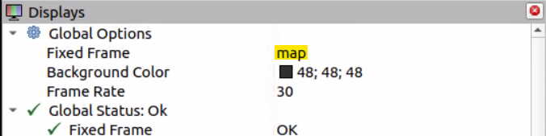
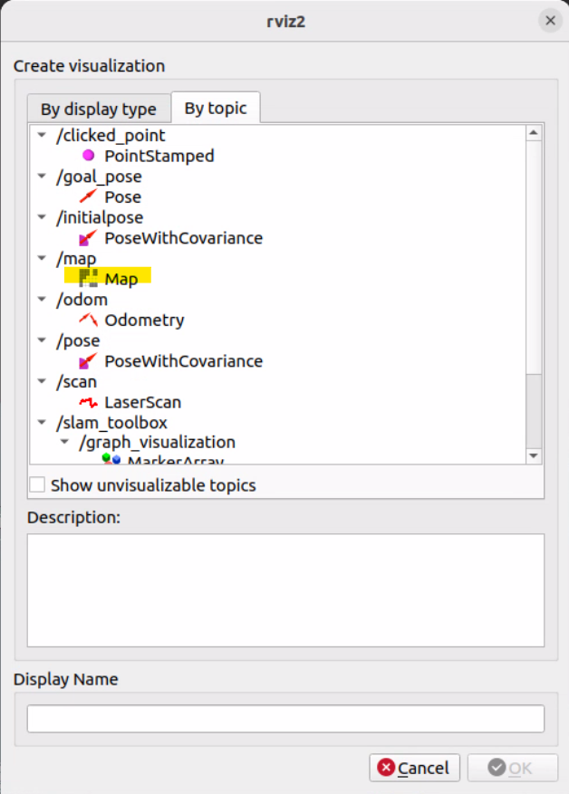
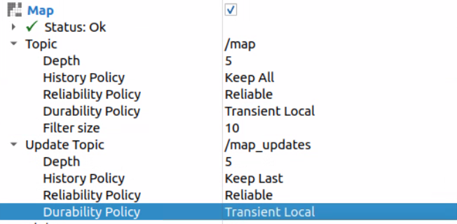
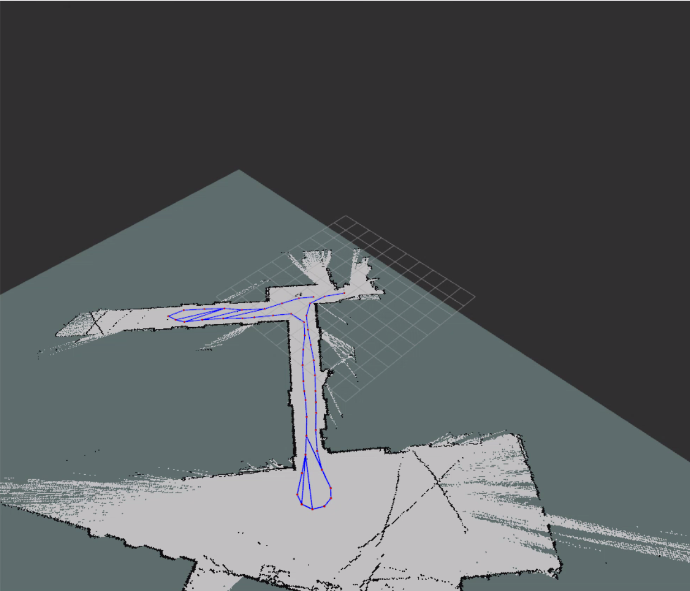

.. _doc_tutorials_slamtoolbox:

SLAM Toolbox
===========================

This page shows how to run SLAM Toolbox on the RoboRacer and visualize the map in RViz2.

🎥 Video Walkthrough
--------------------

.. raw:: html

   <iframe width="560" height="315"
     src="https://www.youtube.com/embed/RanGbHii2m8"
     title="YouTube video player"
     frameborder="0"
     allow="accelerometer; autoplay; clipboard-write; encrypted-media; gyroscope; picture-in-picture; web-share"
     allowfullscreen></iframe>

|

.. important::

   You must have the **controller powered on and connected** before starting SLAM.
   If the controller is not connected, the vehicle will not publish drive data and SLAM will not begin building a map.

.. note::

   Run the ``slam`` alias to start SLAM Toolbox:

   .. code-block:: bash

      slam

   **What** ``slam`` **runs:**

   .. code-block:: bash

      ros2 launch slam_toolbox online_async_launch.py \
        params_file:=/home/nvidia/f1tenth_ws/src/f1tenth_system/f1tenth_stack/config/f1tenth_online_async.yaml

   If your RoboRacer name is ``f1-wsu-1``, your path would look like:

   .. code-block:: bash

      ros2 launch slam_toolbox online_async_launch.py \
        params_file:=/home/f1-wsu-1/f1tenth_ws/src/f1tenth_system/f1tenth_stack/config/f1tenth_online_async.yaml

Run Steps
---------

1️⃣ Bringup (Terminal 1)
^^^^^^^^^^^^^^^^^^^^^^^^

Start the car stack (sensors + drivers + base nodes).

.. code-block:: bash

   cd ~/f1tenth_ws
   source /opt/ros/humble/setup.bash
   source install/setup.bash

   bringup

2️⃣ Turn On and Connect Controller
^^^^^^^^^^^^^^^^^^^^^^^^^^^^^^^^^^^

- Power on the transmitter
- Confirm it is bound to the vehicle
- Verify you have steering and throttle response

SLAM will not build a map unless the car is moving.

3️⃣ Start SLAM Toolbox (Terminal 2)
^^^^^^^^^^^^^^^^^^^^^^^^^^^^^^^^^^^

Open a **separate terminal** and run:

.. code-block:: bash

   cd ~/f1tenth_ws
   source /opt/ros/humble/setup.bash
   source install/setup.bash

   slam

4️⃣ Open RViz2 (Terminal 3)
^^^^^^^^^^^^^^^^^^^^^^^^^^^

Open another terminal (often on your laptop) and run:

.. code-block:: bash

   source /opt/ros/humble/setup.bash
   rviz2

Configure RViz2
---------------

After RViz2 opens:

1️⃣ Set the Fixed Frame  
^^^^^^^^^^^^^^^^^^^^^^^^

- Top left → **Global Options**
- Set **Fixed Frame** to:

::

   map

2️⃣ Add Map Display  
^^^^^^^^^^^^^^^^^^^^

- Click **Add**
- Select **Map**

Then configure the Map display:

- **Topic** → make sure it is:

::

   /map

- **Topic → History Policy** → ``Keep All``
- **Topic → Durability Policy** → ``Transient Local``
- **Update Topic → Durability Policy** → ``Transient Local``

|

3️⃣ Add GraphVisualization  
^^^^^^^^^^^^^^^^^^^^^^^^^^^

- Click **Add**
- Select **GraphVisualization**

.. image:: img/add_graph_visualization.png
   :alt: Configure Map display settings in RViz2
   :width: 80%
   :align: center

4️⃣ Add SLAM Toolbox Panel  
^^^^^^^^^^^^^^^^^^^^^^^^^^^

- Top left → **Panels**
- Select **Add New Panel**
- Choose:

::

   SlamToolBoxPlugin

5️⃣ Drive the Car to Build the Map
^^^^^^^^^^^^^^^^^^^^^^^^^^^^^^^^^^^

With SLAM Toolbox running and RViz2 open, use the **PlayStation controller** to drive the car around the course. As you drive, you will see the map build in real time in RViz2.

**Tips for a good map:**

- Drive **slowly and smoothly** to give the LiDAR time to capture accurate scans.
- Cover the **entire course** — drive every section of the track at least once.
- It is perfectly fine to **drive back over paths you have already mapped** — this helps SLAM close loops and improve accuracy.
- Try to avoid crashing, as sudden movements can introduce scan errors.
- You may notice **stray scan lines** that appear to extend outside the track boundaries — this is normal and expected. They will not affect navigation.

|

*Example map created while driving the RoboRacer around the course. Stray scans outside the boundary are normal.*

.. note::

   When you are satisfied that the map covers the full course, proceed to the next page to save the map.

Common Checks
-------------

- Confirm ``/scan`` is publishing.
- Confirm controller is connected.
- Confirm Fixed Frame is ``map``.
- Confirm Map topic is ``/map``.
- Confirm Durability is set to ``Transient Local``.
- Confirm both machines use the same ``ROS_DOMAIN_ID``.

