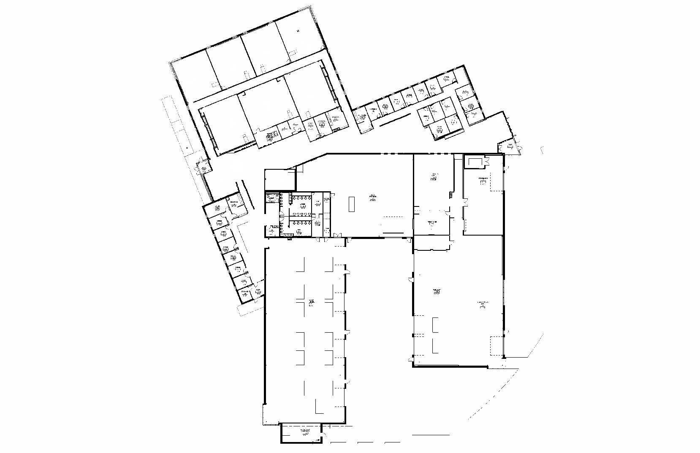

.. _doc_tutorials_particle_filter:

Particle Filter Localization
=============================

Why a Standalone Particle Filter?
-----------------------------------

In the Nav2 tutorials you used **AMCL** — Nav2's built-in particle filter — for localization. AMCL is tightly integrated with Nav2's planner, controller, and behavior tree, making it ideal for point-and-click navigation.

This tutorial introduces the **f1tenth/particle_filter**, a standalone localization package. Both AMCL and this particle filter solve the same problem — *"where am I on this map?"* — using the same core algorithm (Monte Carlo Localization). The difference is how they're used:

.. list-table::
   :header-rows: 1
   :widths: 20 40 40

   * -
     - Nav2 AMCL
     - f1tenth/particle_filter
   * - **Integration**
     - Part of the Nav2 stack (lifecycle managed)
     - Standalone node (runs independently)
   * - **TF published**
     - ``map`` → ``odom``
     - ``map`` → ``base_link``
   * - **Use case**
     - Nav2 navigation (planner + controller)
     - Custom controllers (pure pursuit, follow the gap, etc.)
   * - **Ray casting**
     - Standard CPU
     - RangeLibc with GPU acceleration (CUDA on Jetson)

**Why learn both?** Nav2 handles the full navigation pipeline for you — but in robotics and racing, you often need direct control over the car's behavior. A standalone particle filter gives you localized pose data that you can feed into your own algorithms (pure pursuit, MPC, custom raceline followers) without the overhead of Nav2's planner and controller. This is how competitive F1TENTH teams operate: lightweight localization + custom control for maximum speed.

Once you have a saved map, you can use a **particle filter** (Monte Carlo Localization) to localize the vehicle within that map in real time. This tutorial uses the `f1tenth/particle_filter <https://github.com/f1tenth/particle_filter>`_ package with **RangeLibc** for fast ray casting.

.. note::

   **RangeLibc** is a compiled Python library — it is imported automatically by the particle filter node at startup. You do not need to run it separately. As long as it was built correctly (see :ref:`doc_tutorials_slamtoolbox` for the fix script), it will work transparently in the background.

How It Works
------------

The particle filter maintains a set of hypotheses (particles) about where the car might be on the map. Each particle represents a possible pose (x, y, heading). On each LiDAR scan, the filter:

1. **Predicts** new particle positions using wheel odometry.
2. **Weights** each particle by how well its simulated LiDAR scan matches the real scan.
3. **Resamples** — particles that match the scan better survive; poor matches are discarded.
4. **Publishes** the best estimated pose.

Over time the particles converge on the vehicle's true location.

Topics
------

**Subscribed**

.. list-table::
   :header-rows: 1
   :widths: 30 30 40

   * - Topic
     - Type
     - Description
   * - ``/scan``
     - ``sensor_msgs/LaserScan``
     - LiDAR scan input
   * - ``/vesc/odom``
     - ``nav_msgs/Odometry``
     - Wheel odometry input
   * - ``/initialpose``
     - ``geometry_msgs/PoseWithCovarianceStamped``
     - Initial pose set via RViz2 "2D Pose Estimate"

**Published**

.. list-table::
   :header-rows: 1
   :widths: 30 30 40

   * - Topic
     - Type
     - Description
   * - ``/pf/pose/odom``
     - ``nav_msgs/Odometry``
     - Primary localized pose output
   * - ``/pf/viz/inferred_pose``
     - ``geometry_msgs/PoseStamped``
     - Best estimated pose for visualization
   * - ``/pf/viz/particles``
     - ``geometry_msgs/PoseArray``
     - All particle poses for visualization

Run Steps
---------

1️⃣ Point to Your Map
^^^^^^^^^^^^^^^^^^^^^^

The particle filter ships with a default map (``lab_map_clean``) already configured. If this is your map, **no action is needed** — skip to Step 2.

.. note::

   **Using a different map?** If you need to point the particle filter at a different map, expand the steps below.

   1. Copy your map file into the package's ``maps/`` directory:

      .. code-block:: bash

         cp ~/f1tenth_ws/src/f1tenth_system/f1tenth_stack/maps/my_map.pgm \
            ~/f1tenth_ws/src/f1tenth_system/particle_filter/maps/

   2. Create a YAML metadata file based on the existing template:

      .. code-block:: bash

         cp ~/f1tenth_ws/src/f1tenth_system/particle_filter/maps/lab_map_clean.yaml \
            ~/f1tenth_ws/src/f1tenth_system/particle_filter/maps/my_map.yaml

   3. Edit ``my_map.yaml`` to match your map:

      .. code-block:: yaml

         image: my_map.pgm
         resolution: 0.05
         origin: [-19.8, -36.1, 0]
         negate: 0
         occupied_thresh: 0.65
         free_thresh: 0.25

   4. Update ``localize.yaml`` to use your map name:

      .. code-block:: bash

         code ~/f1tenth_ws/src/f1tenth_system/particle_filter/config/localize.yaml

      Find the ``map_server`` section and change the map name:

      .. code-block:: yaml

         map_server:
           ros__parameters:
             map: 'my_map'

   5. Rebuild the package so the map files are installed to the share directory:

      .. code-block:: bash

         cd ~/f1tenth_ws
         colcon build --packages-select particle_filter
         source install/setup.bash

2️⃣ Bringup (Terminal 1)
^^^^^^^^^^^^^^^^^^^^^^^^^

Start the car stack as usual:

.. code-block:: bash

   cd ~/f1tenth_ws
   source /opt/ros/humble/setup.bash
   source install/setup.bash
   bringup

3️⃣ Launch the Particle Filter (Terminal 2)
^^^^^^^^^^^^^^^^^^^^^^^^^^^^^^^^^^^^^^^^^^^^

.. code-block:: bash

   cd ~/f1tenth_ws
   source /opt/ros/humble/setup.bash
   source install/setup.bash
   ros2 launch particle_filter localize_launch.py

.. note::

   ``localize_launch.py`` handles the map server and lifecycle transitions internally — you do not need to run ``nav2_map_server`` separately.

4️⃣ Open RViz2 (Terminal 3)
^^^^^^^^^^^^^^^^^^^^^^^^^^^^

.. code-block:: bash

   source /opt/ros/humble/setup.bash
   source install/setup.bash
   rviz2

In RViz2:

- Set **Fixed Frame** to ``map``
- Add a **Map** display → Topic: ``/map``
- Add a **PoseArray** display → Topic: ``/pf/viz/particles``
- Add a **Pose** display → Topic: ``/pf/viz/inferred_pose``

5️⃣ Set the Initial Pose
^^^^^^^^^^^^^^^^^^^^^^^^^

The particle filter starts with particles spread randomly across the map. You must tell it roughly where the car is to begin localization:

- In RViz2, click **2D Pose Estimate** in the toolbar
- Click on the map where the car is located
- Drag in the direction the car is facing, then release

The particles will converge around your selected location.

.. note::

   The more accurately you set the initial pose, the faster the filter will converge. If the particles do not converge, try setting the pose again from a clearer location on the map.

6️⃣ Drive to Localize
^^^^^^^^^^^^^^^^^^^^^^

Drive the car using the PlayStation controller. As the car moves, the particle cloud will tighten and track the vehicle's position on the map. The best estimated pose is published on ``/pf/pose/odom``.

Key Parameters
--------------

Tune the particle filter by editing:

.. code-block:: bash

   code ~/f1tenth_ws/src/f1tenth_system/particle_filter/config/localize.yaml

The key parameters are:

.. list-table::
   :header-rows: 1
   :widths: 25 15 60

   * - Parameter
     - Default
     - Description
   * - ``max_particles``
     - ``4000``
     - Number of particles — more particles = more accuracy but higher CPU cost
   * - ``angle_step``
     - ``18``
     - LiDAR downsample factor — higher = faster but less accurate
   * - ``range_method``
     - ``rmgpu``
     - Ray casting method (see below)
   * - ``motion_dispersion_theta``
     - ``0.25``
     - Heading noise — increase if filter diverges at speed

``range_method`` Options
~~~~~~~~~~~~~~~~~~~~~~~~~

.. list-table::
   :header-rows: 1
   :widths: 20 20 60

   * - Method
     - Performance
     - Notes
   * - ``rmgpu``
     - Fastest
     - Requires RangeLibc compiled with CUDA — use on Jetson Orin
   * - ``cddt``
     - Fast
     - CPU only — recommended fallback if no CUDA
   * - ``pcddt``
     - Fast
     - Pruned variant of cddt
   * - ``rm``
     - Moderate
     - CPU only, no precomputation
   * - ``bl``
     - Slowest
     - Brute force — use only for debugging

.. note::

   If you built RangeLibc using the ``fix_range_libc.sh`` script on the Jetson Orin, ``rmgpu`` should work. If you see CUDA errors at runtime, fall back to ``cddt`` by editing ``range_method`` in ``~/f1tenth_ws/src/f1tenth_system/particle_filter/config/localize.yaml`` and setting ``rangelib_variant`` to ``4``.

Troubleshooting
---------------

.. list-table::
   :header-rows: 1
   :widths: 30 70

   * - Problem
     - Solution
   * - Particles spread across the whole map
     - Set the initial pose again using 2D Pose Estimate in RViz2
   * - Filter diverges while driving
     - Increase ``motion_dispersion_theta``; slow down; re-set pose
   * - CUDA errors on launch
     - Change ``range_method`` to ``cddt`` and ``rangelib_variant`` to ``4``
   * - ``/map`` not available
     - Ensure map_server is running and the map path is correct
   * - Particles not moving
     - Confirm ``/vesc/odom`` is publishing; check odometry topic name
