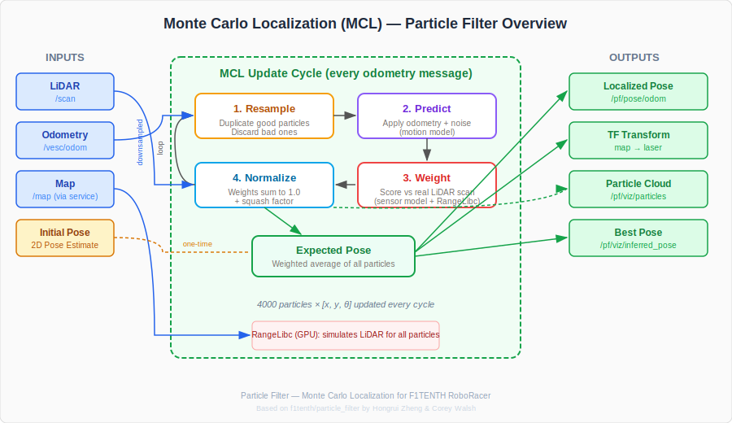

.. _doc_tutorials_particle_filter_code:

Understanding the Particle Filter Code
========================================

This page walks through the key sections of ``particle_filter.py`` — the standalone Monte Carlo Localization node used on the F1TENTH RoboRacer. The goal is to understand *what* each piece does and *why*, so you can reason about the filter's behavior when tuning or debugging.

The Big Picture
---------------

The particle filter answers one question: **"Where am I on this map?"** It does this by maintaining thousands of guesses (particles) about the car's pose and refining them every time new sensor data arrives.

Each update cycle follows four steps:

1. **Resample** — duplicate good particles, discard bad ones
2. **Predict** — move every particle according to odometry (with noise)
3. **Weight** — score each particle by comparing its simulated LiDAR to the real scan
4. **Estimate** — compute the weighted average of all particles as the best pose

This is the ``MCL()`` method at the heart of the node.

Initialization
--------------

.. code-block:: python

   self.particles = np.zeros((self.MAX_PARTICLES, 3))
   self.weights = np.ones(self.MAX_PARTICLES) / float(self.MAX_PARTICLES)

Each particle is a 3-element array: ``[x, y, theta]``. Weights start equal — every particle is equally likely. ``MAX_PARTICLES`` (default 4000) controls the tradeoff between accuracy and CPU cost.

When you click **2D Pose Estimate** in RViz2, ``initialize_particles_pose()`` is called:

.. code-block:: python

   self.particles[:,0] = pose.position.x + np.random.normal(loc=0.0, scale=0.5, size=self.MAX_PARTICLES)
   self.particles[:,1] = pose.position.y + np.random.normal(loc=0.0, scale=0.5, size=self.MAX_PARTICLES)
   self.particles[:,2] = Utils.quaternion_to_angle(pose.orientation) + np.random.normal(loc=0.0, scale=0.4, size=self.MAX_PARTICLES)

This scatters particles in a Gaussian cloud around where you clicked. The ``scale`` values (0.5 m for position, 0.4 rad for heading) control how spread out the initial guess is.

Motion Model
------------

.. code-block:: python

   def motion_model(self, proposal_dist, action):
       cosines = np.cos(proposal_dist[:,2])
       sines = np.sin(proposal_dist[:,2])

       self.local_deltas[:,0] = cosines*action[0] - sines*action[1]
       self.local_deltas[:,1] = sines*action[0] + cosines*action[1]
       self.local_deltas[:,2] = action[2]

       proposal_dist[:,:] += self.local_deltas
       proposal_dist[:,0] += np.random.normal(loc=0.0, scale=self.MOTION_DISPERSION_X, size=self.MAX_PARTICLES)
       proposal_dist[:,1] += np.random.normal(loc=0.0, scale=self.MOTION_DISPERSION_Y, size=self.MAX_PARTICLES)
       proposal_dist[:,2] += np.random.normal(loc=0.0, scale=self.MOTION_DISPERSION_THETA, size=self.MAX_PARTICLES)

**What it does:** Takes the odometry delta (how much the car moved since the last update) and applies it to every particle. The rotation into each particle's frame is critical — ``action`` is in the car's local frame, but each particle has a different heading.

**Why the noise?** Odometry is never perfect — wheels slip, encoders have error. Adding Gaussian noise spreads the particles slightly so they explore nearby poses. ``MOTION_DISPERSION_THETA`` is the most important tuning knob here — if the filter diverges at speed, increase it.

**Why vectorized?** This operates on all 4000 particles at once using NumPy. Doing it in a Python ``for`` loop would be ~1000x slower.

Sensor Model
------------

The sensor model answers: *"How well does this particle's position explain the actual LiDAR scan?"*

Precomputed Lookup Table
~~~~~~~~~~~~~~~~~~~~~~~~~

.. code-block:: python

   def precompute_sensor_model(self):
       for d in range(table_width):      # d = expected (computed) range
           for r in range(table_width):  # r = observed (measured) range
               prob = 0.0
               z = float(r - d)

               # Gaussian: measurement matches expected range
               prob += z_hit * np.exp(-(z*z)/(2.0*sigma_hit*sigma_hit)) / (sigma_hit * np.sqrt(2.0*np.pi))

               # Short reading (obstacle between car and wall)
               if r < d:
                   prob += 2.0 * z_short * (d - r) / float(d)

               # Max range (LiDAR returned max — no return)
               if int(r) == int(self.MAX_RANGE_PX):
                   prob += z_max

               # Random measurement (noise)
               if r < int(self.MAX_RANGE_PX):
                   prob += z_rand * 1.0/float(self.MAX_RANGE_PX)

This builds a table *before* the filter starts running. For every possible (expected range, observed range) pair, it precomputes the probability. This avoids expensive math during the real-time loop.

The four probability components model real LiDAR behavior:

.. list-table::
   :header-rows: 1
   :widths: 20 40 40

   * - Component
     - What It Models
     - Weight Parameter
   * - ``z_hit``
     - Measurement matches expected range (Gaussian)
     - How much to trust accurate readings
   * - ``z_short``
     - Something blocked the beam early (person, box)
     - How much to expect short readings
   * - ``z_max``
     - LiDAR returned max range (no return signal)
     - How much to expect max-range readings
   * - ``z_rand``
     - Random noise / multipath reflections
     - Background noise level

Runtime Evaluation
~~~~~~~~~~~~~~~~~~~

At runtime, the sensor model uses **RangeLibc** to simulate what each particle *would* see, then compares that to what the LiDAR *actually* saw:

.. code-block:: python

   # Simulate LiDAR from each particle's position
   self.range_method.calc_range_repeat_angles(self.queries, self.downsampled_angles, self.ranges)

   # Score: how well does simulated scan match real scan?
   self.range_method.eval_sensor_model(obs, self.ranges, self.weights, num_rays, self.MAX_PARTICLES)

   # Squash factor — prevents any single particle from dominating
   np.power(self.weights, self.INV_SQUASH_FACTOR, self.weights)

The **squash factor** is important: without it, one particle could get a weight millions of times larger than others, causing the filter to collapse onto a single hypothesis. The squash factor (raising weights to a power < 1) flattens the distribution to keep diversity.

The MCL Loop
------------

.. code-block:: python

   def MCL(self, a, o):
       # 1. Resample: draw particles proportional to their weights
       proposal_indices = np.random.choice(self.particle_indices, self.MAX_PARTICLES, p=self.weights)
       proposal_distribution = self.particles[proposal_indices,:]

       # 2. Predict: apply motion model
       self.motion_model(proposal_distribution, a)

       # 3. Weight: apply sensor model
       self.sensor_model(proposal_distribution, o, self.weights)

       # 4. Normalize: weights must sum to 1
       self.weights /= np.sum(self.weights)

       self.particles = proposal_distribution

This is the complete algorithm in four lines of real work:

1. **Resample** — ``np.random.choice`` with ``p=self.weights`` picks particles proportional to their weight. Good particles get duplicated; bad ones disappear.
2. **Predict** — the motion model moves each particle and adds noise.
3. **Weight** — the sensor model scores each particle against the real LiDAR scan.
4. **Normalize** — divide all weights by their sum so they form a proper probability distribution.

The ``expected_pose()`` method then computes the weighted average:

.. code-block:: python

   def expected_pose(self):
       return np.dot(self.particles.transpose(), self.weights)

This is a dot product — each particle's (x, y, theta) multiplied by its weight and summed. The result is the best single pose estimate.

Update Trigger
--------------

.. code-block:: python

   def odomCB(self, msg):
       # ... compute local delta from odometry ...
       self.update()

The filter runs on every **odometry** message (not every LiDAR message). Odometry arrives slower than LiDAR, and each update needs both odometry and LiDAR data. The ``update()`` method checks that all three data sources are initialized before running MCL:

.. code-block:: python

   if self.lidar_initialized and self.odom_initialized and self.map_initialized:

TF and Odometry Output
----------------------

.. code-block:: python

   def publish_tf(self, pose, stamp=None):
       t = TransformStamped()
       t.header.frame_id = '/map'
       t.child_frame_id = '/laser'
       t.transform.translation.x = pose[0]
       t.transform.translation.y = pose[1]

The particle filter publishes a TF transform from ``map`` to ``laser``, telling ROS where the car is on the map. It also publishes the pose as an ``Odometry`` message on ``/pf/pose/odom`` — this is what your pure pursuit node subscribes to.

The odometry message includes the **covariance** computed from the particle distribution:

.. code-block:: python

   cov_mat = np.cov(self.particles, rowvar=False, ddof=0, aweights=self.weights).flatten()
   odom.pose.covariance[:cov_mat.shape[0]] = cov_mat

This tells downstream nodes how confident the filter is. A tight particle cloud = low covariance = high confidence.

Map and RangeLibc
-----------------

.. code-block:: python

   def get_omap(self):
       # Fetch map from map_server
       oMap = range_libc.PyOMap(map_msg)
       self.MAX_RANGE_PX = int(self.MAX_RANGE_METERS / self.map_info.resolution)

       # Initialize ray casting engine
       if self.WHICH_RM == 'rmgpu':
           self.range_method = range_libc.PyRayMarchingGPU(oMap, self.MAX_RANGE_PX)

The map is fetched from ``map_server`` via a service call, then loaded into RangeLibc. RangeLibc is a compiled C++/CUDA library that performs fast ray casting — simulating thousands of LiDAR scans per update cycle. On the Jetson Orin with ``rmgpu``, this runs on the GPU for maximum speed.

LiDAR Downsampling
------------------

.. code-block:: python

   self.downsampled_angles = np.copy(self.laser_angles[0::self.ANGLE_STEP]).astype(np.float32)

The ``ANGLE_STEP`` parameter (default 18) takes every 18th LiDAR ray instead of all ~1080. This dramatically reduces computation while retaining enough angular coverage for accurate localization. Increasing ``ANGLE_STEP`` makes the filter faster but less precise.

Key Takeaways
-------------

- The particle filter is **embarrassingly parallel** — every particle is independent, which is why NumPy vectorization and GPU ray casting provide massive speedups.
- The **motion model adds noise** on purpose — this is how the filter explores the space and recovers from errors.
- The **sensor model is precomputed** as a lookup table — runtime evaluation is just table indexing, not probability math.
- The **squash factor** prevents particle collapse — without it, the filter would quickly converge to a single point and lose the ability to self-correct.
- The filter publishes ``map`` to ``laser`` TF and ``/pf/pose/odom`` — these are what your nodes use for localization.
