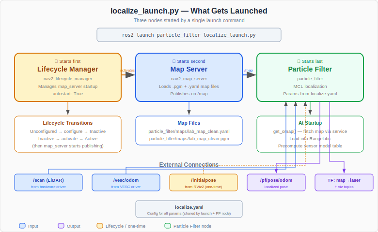

.. _doc_tutorials_particle_filter_launch:

Understanding the Launch File
==============================

When you run ``ros2 launch particle_filter localize_launch.py``, three nodes start behind the scenes. This page walks through ``localize_launch.py`` to explain what each piece does.

What Happens When You Launch
-----------------------------

.. code-block:: bash

   ros2 launch particle_filter localize_launch.py

This single command starts:

1. **Lifecycle Manager** — brings the map server through its startup sequence
2. **Map Server** — loads your saved ``.pgm`` map and publishes it on ``/map``
3. **Particle Filter** — subscribes to ``/scan`` and ``/vesc/odom``, publishes localized pose

These three nodes work together: the lifecycle manager activates the map server, which provides the map that the particle filter uses for ray casting.

Loading the Config
------------------

.. code-block:: python

   localize_config = os.path.join(
       get_package_share_directory('particle_filter'),
       'config',
       'localize.yaml'
   )
   localize_config_dict = yaml.safe_load(open(localize_config, 'r'))
   map_name = localize_config_dict['map_server']['ros__parameters']['map']

The launch file reads ``localize.yaml`` at launch time (not runtime) to extract the map name. This is a common ROS 2 pattern — reading the YAML config during launch so the map server and particle filter can both use the same map without duplicating the setting.

``get_package_share_directory('particle_filter')`` resolves to the installed package location (inside ``install/``), not the source directory. This is why you must run ``colcon build`` after changing config files.

Launch Arguments
----------------

.. code-block:: python

   localize_la = DeclareLaunchArgument(
       'localize_config',
       default_value=localize_config,
       description='Localization configs')
   map_name_la = DeclareLaunchArgument(
       'map_name',
       default_value=map_name,
       description='Map name (without extension) in particle_filter/maps/')

Two arguments are declared with defaults from the config file:

- ``localize_config`` — path to the full YAML config (rarely overridden)
- ``map_name`` — the map name without extension, read from ``localize.yaml``

You can override the map name at launch time:

.. code-block:: bash

   ros2 launch particle_filter localize_launch.py map_name:=hallway_map

Node 1: Particle Filter
------------------------

.. code-block:: python

   pf_node = Node(
       package='particle_filter',
       executable='particle_filter',
       name='particle_filter',
       parameters=[LaunchConfiguration('localize_config')]
   )

This launches the particle filter node (the ``particle_filter.py`` code reviewed in the previous page). It receives all its parameters — ``max_particles``, ``range_method``, ``motion_dispersion_theta``, etc. — from ``localize.yaml`` via ``LaunchConfiguration('localize_config')``.

Node 2: Map Server
------------------

.. code-block:: python

   map_server_node = Node(
       package='nav2_map_server',
       executable='map_server',
       name='map_server',
       parameters=[{'yaml_filename': PathJoinSubstitution(
                        [FindPackageShare('particle_filter'), 'maps',
                         [LaunchConfiguration('map_name'), '.yaml']])},
                   {'topic': 'map'},
                   {'frame_id': 'map'},
                   {'output': 'screen'},
                   {'use_sim_time': True}]
   )

The map server is a Nav2 node that loads an occupancy grid map from a ``.yaml`` + ``.pgm`` file pair and publishes it on the ``/map`` topic. Key details:

- **yaml_filename** — built dynamically from ``map_name``. If ``map_name`` is ``lab_map_clean``, it resolves to ``.../particle_filter/maps/lab_map_clean.yaml``
- **PathJoinSubstitution** — a ROS 2 launch utility that joins path segments and resolves ``LaunchConfiguration`` values at launch time
- **FindPackageShare** — finds the installed package's ``share/`` directory (not ``src/``)
- **frame_id: map** — the map is published in the ``map`` coordinate frame
- **use_sim_time: True** — this is a legacy setting from simulation; on real hardware it has no practical effect since the particle filter uses wall-clock time

.. note::

   The map server is a **lifecycle node** — it does not start publishing immediately. It must be transitioned through ``configure`` → ``activate`` states before it serves the map. That is what the lifecycle manager does.

Node 3: Lifecycle Manager
--------------------------

.. code-block:: python

   nav_lifecycle_node = Node(
       package='nav2_lifecycle_manager',
       executable='lifecycle_manager',
       name='lifecycle_manager_localization',
       output='screen',
       parameters=[{'use_sim_time': True},
                   {'autostart': True},
                   {'node_names': ['map_server']}]
   )

The lifecycle manager watches the map server and automatically transitions it through its startup states:

1. **Unconfigured** → ``configure`` → **Inactive** — loads the map file into memory
2. **Inactive** → ``activate`` → **Active** — starts publishing on ``/map``

``autostart: True`` means this happens automatically at launch. Without the lifecycle manager, you would need to manually call the state transitions via service calls.

``node_names: ['map_server']`` tells the lifecycle manager which nodes to manage. Only the map server needs lifecycle management here — the particle filter is a regular node that starts immediately.

Launch Order
------------

.. code-block:: python

   ld.add_action(nav_lifecycle_node)
   ld.add_action(map_server_node)
   ld.add_action(pf_node)

The nodes are added in this order:

1. **Lifecycle manager first** — so it is ready to manage the map server as soon as it appears
2. **Map server second** — the lifecycle manager detects it and transitions it to active
3. **Particle filter last** — it calls the ``/map_server/map`` service to fetch the map, so the map server must be active first

.. note::

   The particle filter's ``get_omap()`` method waits in a loop for the map service to become available (``wait_for_service``), so even if the map server takes a moment to activate, the particle filter will wait patiently.

The Complete Flow
-----------------

When you run ``ros2 launch particle_filter localize_launch.py``:

1. Launch reads ``localize.yaml`` to get the map name and config path
2. Lifecycle manager starts and waits for the map server
3. Map server starts, lifecycle manager transitions it to active, map is published on ``/map``
4. Particle filter starts, calls ``/map_server/map`` to fetch the occupancy grid
5. Particle filter loads the map into RangeLibc for GPU ray casting
6. Particle filter waits for LiDAR (``/scan``) and odometry (``/vesc/odom``) messages
7. You set the initial pose via RViz2's 2D Pose Estimate
8. The filter begins localizing — publishing pose on ``/pf/pose/odom`` and TF on ``map`` → ``laser``
