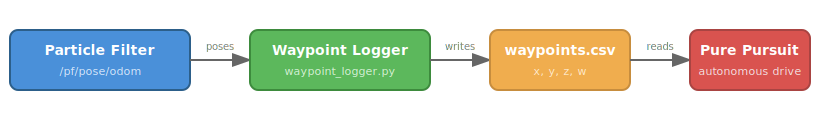
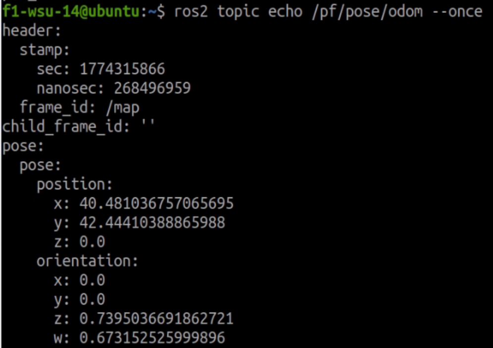

.. _doc_tutorials_building_waypoint_logger:

Building the Waypoint Logger
=============================

Before you can record waypoints, you need to create the ``pure_pursuit`` package and write the ``waypoint_logger`` node. This tutorial walks through the code step by step.

.. note::

   This tutorial covers the concepts behind the code. For the graded assignment with deliverables, see **Lab 6 - Waypoint Logger for Pure Pursuit** in the Weber Assignments.

Why a Waypoint Logger?
-----------------------

Pure Pursuit needs a pre-recorded path to follow. That path is a CSV file of poses (x, y, heading) captured while you manually drive the car around the track. The waypoint logger subscribes to the particle filter's pose output and writes each pose to a file as you drive.

The pipeline looks like this:

The particle filter publishes the car's estimated map-relative position at ~30-40 Hz. Your logger captures those poses so the Pure Pursuit node can replay the path later.

Step 1 --- Create the Package
------------------------------

On the robot, create a new ROS 2 Python package:

.. code-block:: bash

   cd ~/f1tenth_ws/src
   ros2 pkg create pure_pursuit --build-type ament_python --dependencies rclpy nav_msgs geometry_msgs visualization_msgs std_msgs

This generates the standard ``ament_python`` package structure:

.. code-block:: text

   pure_pursuit/
       package.xml
       setup.py
       setup.cfg
       pure_pursuit/
           __init__.py

The ``--dependencies`` flag adds ``rclpy``, ``nav_msgs``, and ``geometry_msgs`` to ``package.xml`` automatically. These are the packages your node will import.

Create a directory to store waypoint CSV files:

.. code-block:: bash

   mkdir -p ~/f1tenth_ws/src/pure_pursuit/maps

Step 2 --- Understand the Data Source
--------------------------------------

The particle filter publishes on ``/pf/pose/odom`` using the ``nav_msgs/msg/Odometry`` message type. The fields you care about are nested inside the message:

.. code-block:: text

   Odometry
       pose
           pose
               position
                   x       <-- map x coordinate
                   y       <-- map y coordinate
               orientation
                   z       <-- quaternion z (encodes heading)
                   w       <-- quaternion w (encodes heading)

You can inspect a live message yourself to see exactly what the particle filter publishes. You need bringup and the particle filter running first:

1. Start **bringup** (Terminal 1)
2. Launch the **particle filter** (Terminal 2):

   .. code-block:: bash

      cd ~/f1tenth_ws
      source /opt/ros/humble/setup.bash
      source install/setup.bash
      ros2 launch particle_filter localize_launch.py

3. Open **RViz2** with the particle filter config (Terminal 3):

   .. code-block:: bash

      source /opt/ros/humble/setup.bash
      source install/setup.bash
      rviz2 -d ~/f1tenth_ws/install/particle_filter/share/particle_filter/rviz/pf.rviz

   Set the **2D Pose Estimate** so the particle filter is localized.

4. Echo the topic (Terminal 4):

   .. code-block:: bash

      ros2 topic echo /pf/pose/odom --once

This prints a single Odometry message showing all the fields:

Most of this message is not needed. Your logger only extracts four values from the ``pose.pose`` section:

.. list-table::
   :header-rows: 1
   :widths: 15 15 70

   * - Field
     - Units
     - Description
   * - ``position.x``
     - meters
     - Car's horizontal position on the map
   * - ``position.y``
     - meters
     - Car's vertical position on the map
   * - ``orientation.z``
     - unitless (-1 to 1)
     - Quaternion z --- encodes heading (rotation around vertical axis)
   * - ``orientation.w``
     - unitless (-1 to 1)
     - Quaternion w --- scalar part; with z, gives heading: ``2 * atan2(z, w)``

.. note::

   **Why quaternions instead of an angle?** ROS 2 uses quaternions to represent orientation because they avoid gimbal lock and singularities. For a car driving on a flat surface, only ``z`` and ``w`` matter (``x`` and ``y`` are zero). You don't need to convert to an angle for storage --- just save the raw ``z`` and ``w`` values. The Pure Pursuit node will convert them when it needs the heading.

Step 3 --- Write the Node
--------------------------

Create ``pure_pursuit/pure_pursuit/waypoint_logger.py``. The node has three responsibilities:

1. **Open a CSV file** when it starts
2. **Subscribe** to ``/pf/pose/odom`` and write each pose to the file
3. **Close the file** cleanly on shutdown

Subscription and Callback
^^^^^^^^^^^^^^^^^^^^^^^^^^

The core of a ROS 2 subscriber node is the callback. Every time the particle filter publishes a new pose, your callback fires and receives the ``Odometry`` message:

.. code-block:: python

   from nav_msgs.msg import Odometry

   self.subscription = self.create_subscription(
       Odometry,
       '/pf/pose/odom',
       self.pose_callback,
       10
   )

The ``10`` is the QoS queue depth --- it buffers up to 10 messages if the callback is slow. For a simple CSV writer this is more than enough.

Extracting Pose Data
^^^^^^^^^^^^^^^^^^^^^

Inside the callback, pull out the four values you need:

.. code-block:: python

   def pose_callback(self, msg):
       x = msg.pose.pose.position.x
       y = msg.pose.pose.position.y
       z = msg.pose.pose.orientation.z
       w = msg.pose.pose.orientation.w

These four numbers fully describe where the car is and which direction it is facing.

Writing to CSV
^^^^^^^^^^^^^^^

Use Python's built-in ``csv`` module or simply write comma-separated strings. The CSV should have **no header row** --- just four values per line:

.. code-block:: text

   1.234, 5.678, 0.123, 0.992
   1.245, 5.690, 0.125, 0.992
   ...

Open the file when the node initializes and write in the callback:

.. code-block:: python

   import csv

   self.file = open('/path/to/waypoints.csv', 'w', newline='')
   self.writer = csv.writer(self.file)

   # In the callback:
   self.writer.writerow([x, y, z, w])

Clean Shutdown
^^^^^^^^^^^^^^^

When you press Ctrl+C, ROS 2 shuts down the node. You need to make sure the CSV file is closed properly so no data is lost. Two common approaches:

1. **try/finally** in ``main()``:

   .. code-block:: python

      def main():
          rclpy.init()
          node = WaypointLogger()
          try:
              rclpy.spin(node)
          finally:
              node.file.close()
              node.destroy_node()
              rclpy.shutdown()

2. **Override** ``destroy_node()``:

   .. code-block:: python

      def destroy_node(self):
          self.file.close()
          super().destroy_node()

Either approach works. The key is that the file gets closed so the OS flushes all buffered writes to disk.

Recording Quality — Minimum Distance Filter
^^^^^^^^^^^^^^^^^^^^^^^^^^^^^^^^^^^^^^^^^^^^

Recording at full 30-40 Hz frequency produces problems when the car is stationary, slow, or jerky — hundreds of waypoints cluster at the same map location, and pure pursuit oscillates trying to track them. The fix is to only write a waypoint when the car has moved a minimum distance from the last recorded point:

.. code-block:: python

   import math

   # In __init__:
   self.last_x = None
   self.last_y = None
   self.min_distance = 0.1  # meters between waypoints

   # In pose_callback, before writing to CSV:
   if self.last_x is not None:
       dist = math.hypot(x - self.last_x, y - self.last_y)
       if dist < self.min_distance:
           return
   self.last_x = x
   self.last_y = y

This produces evenly-spaced waypoints regardless of how fast or slow the car moves. Tune ``min_distance`` up (0.2 m) for sparser paths on large tracks, or down (0.05 m) for tighter paths with sharp corners.

If you have an existing recording without this filter, you can thin it after the fact:

.. code-block:: bash

   awk 'NR % 5 == 0' waypoints.csv > waypoints_clean.csv

Terminal Feedback
^^^^^^^^^^^^^^^^^^

At ~30-40 Hz, printing every pose would flood the terminal. Instead, print a confirmation periodically (e.g., every 50th pose):

.. code-block:: python

   self.count = 0

   def pose_callback(self, msg):
       # ... write to CSV ...
       self.count += 1
       if self.count % 50 == 0:
           self.get_logger().info(f'Recorded {self.count} waypoints')

This gives you visual feedback that the logger is working without overwhelming the output.

Live Visualization in RViz2
^^^^^^^^^^^^^^^^^^^^^^^^^^^^

Your waypoint logger can publish markers to RViz2 so you can see the recorded path growing in real time as you drive. The ``pf.rviz`` layout already has these displays configured — no RViz2 setup needed.

Add these imports:

.. code-block:: python

   from nav_msgs.msg import Path
   from geometry_msgs.msg import PoseStamped
   from visualization_msgs.msg import Marker, MarkerArray
   from std_msgs.msg import ColorRGBA
   from rclpy.qos import QoSProfile, QoSDurabilityPolicy, QoSReliabilityPolicy, QoSHistoryPolicy

Add this to ``__init__``:

.. code-block:: python

   latched_qos = QoSProfile(
       depth=1,
       durability=QoSDurabilityPolicy.TRANSIENT_LOCAL,
       reliability=QoSReliabilityPolicy.RELIABLE,
       history=QoSHistoryPolicy.KEEP_LAST,
   )
   self.marker_pub = self.create_publisher(MarkerArray, '/waypoint_viz/waypoints', latched_qos)
   self.path_pub = self.create_publisher(Path, '/waypoint_viz/path', latched_qos)
   self.path_msg = Path()
   self.path_msg.header.frame_id = 'map'
   self.marker_array = MarkerArray()

Add this method to your class — call it in the callback after writing to the CSV:

.. code-block:: python

   def publish_waypoint_viz(self, x, y, z, w):
       """Publishes the current list of waypoints to RViz for live visualization."""
       m = Marker()
       m.header.frame_id = 'map'
       m.header.stamp = self.get_clock().now().to_msg()
       m.ns = 'waypoints'
       m.id = len(self.marker_array.markers)
       m.type = Marker.SPHERE
       m.action = Marker.ADD
       m.pose.position.x = x
       m.pose.position.y = y
       m.scale.x = 0.1
       m.scale.y = 0.1
       m.scale.z = 0.1
       m.color = ColorRGBA(r=1.0, g=1.0, b=0.0, a=1.0)
       m.pose.orientation.w = 1.0
       self.marker_array.markers.append(m)
       self.marker_pub.publish(self.marker_array)

       ps = PoseStamped()
       ps.header.frame_id = 'map'
       ps.pose.position.x = x
       ps.pose.position.y = y
       ps.pose.orientation.z = z
       ps.pose.orientation.w = w
       self.path_msg.poses.append(ps)
       self.path_msg.header.stamp = self.get_clock().now().to_msg()
       self.path_pub.publish(self.path_msg)

In the callback, after writing to the CSV and updating the distance tracker, call ``self.publish_waypoint_viz(x, y, z, w)``. You should see yellow dots and an orange path building in RViz2 as you drive.

.. note::

   This publishes on ``/waypoint_viz/waypoints`` and ``/waypoint_viz/path`` — the same topics used by the ``waypoint_viz`` package during pure pursuit. During recording, your logger node handles the visualization directly. During pure pursuit, a separate ``waypoint_viz`` node reads the saved CSV and shows the path plus a green lookahead marker.

Step 4 --- Register the Entry Point
-------------------------------------

ROS 2 Python packages use ``setup.py`` entry points to define executable node names. Edit ``setup.py`` in the ``pure_pursuit`` package and add your node to ``console_scripts``:

.. code-block:: python

   entry_points={
       'console_scripts': [
           'waypoint_logger = pure_pursuit.waypoint_logger:main',
       ],
   },

This maps the command ``ros2 run pure_pursuit waypoint_logger`` to the ``main()`` function in your ``waypoint_logger.py`` file.

Step 5 --- Build and Verify
-----------------------------

.. code-block:: bash

   cd ~/f1tenth_ws
   colcon build --packages-select pure_pursuit
   source install/setup.bash

Verify the node is registered:

.. code-block:: bash

   ros2 run pure_pursuit waypoint_logger --help

If it launches without import errors, the package is built correctly. You can now proceed to :ref:`doc_tutorials_waypoint_recording` to record a lap of waypoints on the actual robot.

Key Concepts Recap
-------------------

.. list-table::
   :header-rows: 1
   :widths: 30 70

   * - Concept
     - What You Learned
   * - ``ament_python`` package
     - ROS 2 Python package structure with ``setup.py``, entry points, and dependencies
   * - Subscriptions
     - How to subscribe to a topic and process messages in a callback
   * - Odometry message
     - How pose data is structured inside ``nav_msgs/msg/Odometry``
   * - CSV file I/O
     - Writing real-time data to a file with clean shutdown handling
