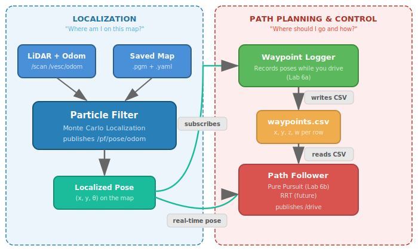

.. _doc_tutorials_waypoint_recording:

Recording Waypoints
====================

Where This Fits
----------------

Recording waypoints is the first step in the **Path Planning & Control** side of the pipeline. The particle filter provides localization — now you use that localized pose to record a path for the car to follow.

Pure Pursuit follows a pre-recorded path. Before the car can drive autonomously, you must drive it around the track manually once to record the waypoints.

How It Works
------------

While the particle filter is running and the car is localized, a waypoint logger node subscribes to ``/pf/pose/odom`` and saves each pose to a CSV file as you drive. The pure pursuit node later reads this CSV and follows the path.

Prerequisites
-------------

- ``bringup`` running (Terminal 1)
- ``ros2 launch particle_filter localize_launch.py`` running (Terminal 2)
- RViz2 running with the particle filter config (Terminal 3):

  .. code-block:: bash

     rviz2 -d ~/f1tenth_ws/install/particle_filter/share/particle_filter/rviz/pf.rviz

- Initial pose set via **2D Pose Estimate** — car must be localized before recording

The particle filter is what gives the robot its position on the map. Without it, the robot has no way to know where it is relative to the map, and the recorded waypoints would be meaningless. Make sure the particle filter is running and the car is localized (2D Pose Estimate set in RViz2) **before** you start recording.

Steps
-----

1️⃣ Start the Waypoint Logger (Terminal 4)
^^^^^^^^^^^^^^^^^^^^^^^^^^^^^^^^^^^^^^^^^^^

.. note::

   The ``pure_pursuit`` package and ``waypoint_logger`` node do not come pre-installed. You must build them yourself first — see **Lab 6 - Waypoint Logger for Pure Pursuit** in the Weber Assignments for step-by-step instructions on creating the package and writing the node.

.. code-block:: bash

   cd ~/f1tenth_ws
   source /opt/ros/humble/setup.bash
   source install/setup.bash
   ros2 run pure_pursuit waypoint_logger

The logger will begin recording poses as the car moves.

2️⃣ Drive the Full Track
^^^^^^^^^^^^^^^^^^^^^^^^^

Using the PlayStation controller, drive the car around the complete track at a moderate speed. The logger saves a waypoint at each pose published by the particle filter.

**Tips for a good recording:**

- Drive at the speed you want the car to autonomously follow
- Cover the entire track — drive all sections at least once
- Close the loop — finish at approximately the same location you started
- Avoid sharp jerks or corrections, as these will be recorded into the path

3️⃣ Stop the Logger
^^^^^^^^^^^^^^^^^^^^^

When you have completed the full lap and returned near the start position, press **Ctrl+C** to stop the logger.

The waypoints are saved to:

.. code-block:: text

   ~/f1tenth_ws/src/pure_pursuit/maps/waypoints.csv

4️⃣ Verify the Recording
^^^^^^^^^^^^^^^^^^^^^^^^^

Check that the file was created and contains data:

.. code-block:: bash

   wc -l ~/f1tenth_ws/src/pure_pursuit/maps/waypoints.csv

A full lap should produce several hundred waypoints. If the count is very low, the car may not have been localized during recording — re-run with the particle filter active and initial pose set.

.. note::

   Once recorded, the waypoints file can be reused each session. You only need to re-record if the map changes or the track layout changes.
